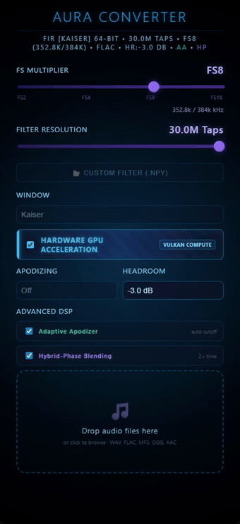
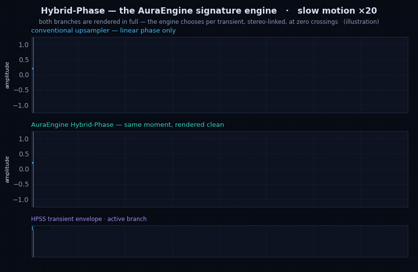
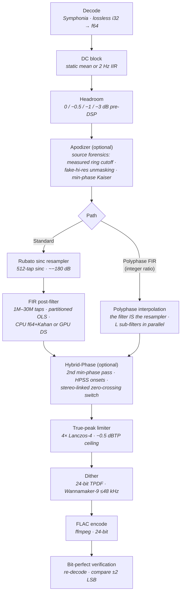
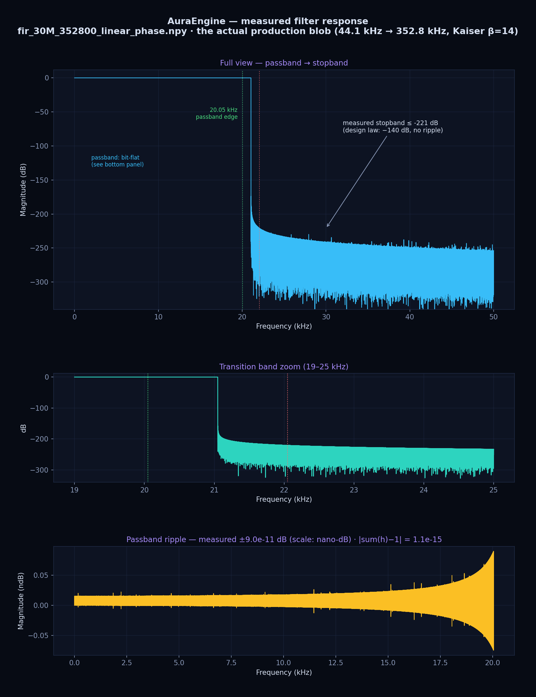
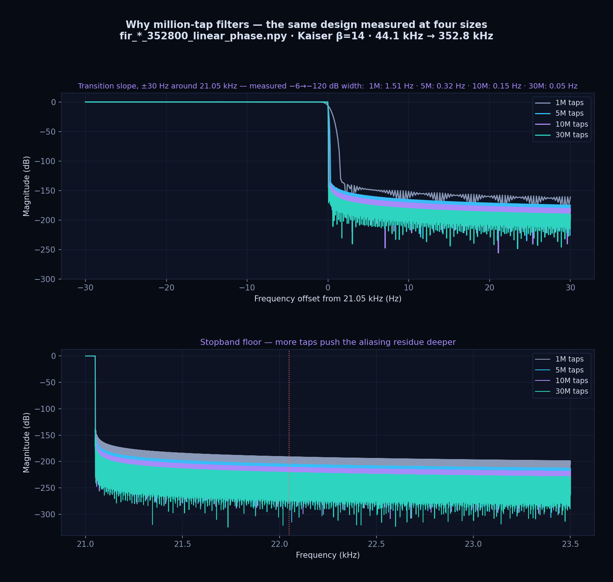

<div align="center">


# AuraEngine

**A no-compromise offline audio upsampler for audiophiles.**

Million-tap FIR filters · Hybrid-Phase transient engine · GPU double-single precision convolution
· true-peak protection · bit-perfect output verification

[](https://github.com/ToxaDev/aura-engine/actions/workflows/ci.yml)
[](LICENSE)


</div>

---

<a href="docs/media/aura-demo.mp4"></a>

**AuraEngine** takes ordinary 44.1/48 kHz FLAC/WAV/MP3 files and re-renders
them offline at up to **768 kHz / 24-bit FLAC**, using FIR filters of
**1 to 30 million taps** whose coefficients are designed in **128-bit
precision**. Because it is not bound by real-time constraints, it can spend
the math your DAC's built-in interpolation filter never could: the DAC then
receives an already-reconstructed, oversampled waveform and only has to play
it.

Everything the engine does is **verifiable by design**: the full DSP trace is
logged to the console, every output file is re-decoded and compared
sample-by-sample against the internal f64 buffer, and files that fail
verification are renamed `_UNVERIFIED` instead of being silently kept.

**Highlights**

- **⭐ The Hybrid-Phase engine — the signature invention of this project.**
  The track is rendered **twice in full** (linear phase + minimum phase) and
  a transient detector switches between the two renders per-attack,
  stereo-linked, at zero crossings. Pre-ringing gone, stereo image intact —
  [see it animated below](#the-hybrid-phase-engine--why-this-exists).
- **Massive FIR upsampling** — per-ratio Kaiser (β = 14) filters, 1M–30M taps,
  measured stopband below **−220 dB**, designed offline in 128-bit precision
  and applied in end-to-end **f64** with Kahan-compensated summation.
- **Adaptive apodizer v3 — source forensics** — measures the exact *frequency*
  of the ADC/SRC pre-ring baked into a master and places a minimum-phase
  corrective lowpass just below it; unmasks fake hi-res (upsampled masters,
  including mirror-image aliasing from bad resamplers) at any container rate;
  leaves clean and minimum-phase sources untouched.
- **GPU acceleration with no precision loss** — convolution runs on Vulkan
  compute in **double-single (DS) arithmetic** (~48-bit effective mantissa,
  ~−260 dB residual vs f64), enforced at the SPIR-V level with
  `NoContraction` so the driver cannot fold it back to f32.
- **True-peak safety** — 4× Lanczos-4 intersample peak scan with a −0.5 dBTP
  ceiling, applied only when needed; quiet material passes bit-exact.
- **Honest output** — 24-bit TPDF dither (Wannamaker-9 noise shaping at
  ≤48 kHz), then a **bit-perfect re-decode verification** of every FLAC.

<br clear="right"/>

## The Hybrid-Phase engine — why this exists

<p align="center">
  
</p>

Every FIR filter forces a trade. **Linear phase** keeps inter-channel timing
perfect — the stereo image stays holographic — but it *pre-rings*: a faint
anticipatory smear arrives **before** every drum hit. **Minimum phase** hits
perfectly clean, but warps timing across frequencies. The industry's usual
answer is a fixed "intermediate-phase" compromise filter — which simply
carries a little of both flaws, everywhere, all the time.

**Hybrid-Phase refuses the trade.** AuraEngine renders the track **twice, in
full** — one complete linear-phase pass and one complete minimum-phase pass —
then a native-Rust HPSS transient detector decides, moment by moment, which
render you hear: linear phase through sustains and decays (imaging),
minimum phase through attacks (zero pre-ringing). The switch itself is
engineered to be inaudible:

- fires only at a **zero crossing of the mid signal**;
- **stereo-linked** — one switch plan applied to both channels at the same
  sample, so the image can never skew;
- 32-sample raised-cosine micro-fade (~0.09 ms) + 20 ms anti-chatter hold;
- both renders aligned sample-exact via band-weighted group delay before
  blending.

This technique was invented for AuraEngine. We are not aware of any other
converter that does content-aware switching between two complete phase
renders — if you know one, open an issue: we would genuinely love to compare
notes. The verification methodology is documented in
[docs/06-hybrid-phase-proof.md](docs/06-hybrid-phase-proof.md).

## The signal path



Two conversion paths share the same preparation and output stages:

| | Standard path | Polyphase FIR path |
|---|---|---|
| Resampler | Rubato `SincFixedIn` (512-tap sinc), then the big FIR as a post-filter | The big FIR **is** the resampler — decomposed into L sub-filters running in parallel |
| Ratios | Any | Integer only (non-integer targets snap down: 44.1 kHz → FS8 gives 352.8 kHz) |
| Trailing padding | ~0.4 s of resampler zero-pad | None — output length is exactly input × L |
| Filter blobs missing | Post-filter skipped with a warning | Hard error (by design — no silent quality downgrade) |

A detailed, beautifully rendered walkthrough of every stage lives at
**[toxadev.github.io/aura-engine](https://toxadev.github.io/aura-engine/)**
(source: [docs/index.html](docs/index.html)), and the same material as plain
markdown starts at **[docs/README.md](docs/README.md)**. The engineering laws the DSP core is
audited against are in **[DSP_MANIFESTO.md](DSP_MANIFESTO.md)**.

## Quick start (Windows)

> AuraEngine is developed and tested on **Windows 11** (Windows 10 should
> work but is untested). Linux/macOS are currently not supported — the build
> uses the MSVC toolchain and a few Win32 APIs for thread priority and timer
> resolution.

**Just want to try it?** Grab the portable zip from the
[**Releases page**](https://github.com/ToxaDev/aura-engine/releases) — no
Rust needed (you still need `ffmpeg` on `PATH`, and the FIR filter files for
the million-tap stages, see step 3). To build from source instead:

### 1. Prerequisites

| Requirement | Why | Notes |
|---|---|---|
| [Rust](https://rustup.rs/) (stable, MSVC) | builds the app | recent stable recommended (fat LTO) |
| [ffmpeg](https://www.gyan.dev/ffmpeg/builds/) on `PATH` | FLAC encoding | the only external runtime tool |
| [Python 3.10+](https://www.python.org/) with `numpy scipy mpmath soundfile` | generates the FIR filters | one-time step |
| WebView2 runtime | Tauri UI | ships with Windows 11 |
| Vulkan-capable GPU *(optional)* | GPU DS convolution path | falls back to CPU automatically |

### 2. Clone and build

```bat
git clone https://github.com/ToxaDev/aura-engine.git
cd aura-engine\desktop-app
start.bat
```

`start.bat` compiles the release binary on first run and launches it.
Subsequent runs skip cargo entirely when nothing changed (instant start);
`start.bat --build` forces a rebuild, `--clean` wipes the build cache.
No Node.js, no npm, no Tauri CLI — the frontend is static HTML/JS embedded
into the binary.

### 3. Get the FIR filters (one-time)

The converter loads pre-computed filter coefficient files (`.npy`) —
it deliberately refuses to synthesize filters at runtime, because runtime
generation could not match the 128-bit design precision.

**Easiest way:** download a ready-made filter pack from the
[Releases page](https://github.com/ToxaDev/aura-engine/releases) (pick the
tap count you plan to use — e.g. `aura-filters-10M-all-rates.zip`) and
extract it into the repo/app folder — the archives already contain the
`fir-optimizer/output/` structure.

**Or generate them yourself:**

```bat
cd ..\fir-optimizer
pip install -r requirements.txt
python optimize.py --all-ratios
```

`--all-ratios` populates `fir-optimizer/output/` with the full matrix —
4 tap sizes × 8 output rates × 2 phase types = 64 files, roughly **10 GB**,
and it can take a while for the 30M presets. It skips files that already
exist, so you can interrupt and resume. If you only care about one preset,
see [fir-optimizer/README.md](fir-optimizer/README.md) for generating a
subset. Store the blobs anywhere by setting the `AURA_FILTER_DIR`
environment variable to the folder that contains them.

### 4. Convert

1. Launch the app (`start.bat`).
2. Set the **FS multiplier** (FS2–FS16) and **filter resolution** (1M–30M taps).
3. Optionally enable **Adaptive Apodizer**, **Hybrid-Phase Blending**,
   **Polyphase FIR Resampling**, or **Hardware GPU Acceleration**.
4. Drop files onto the window — conversion starts immediately.
5. The output FLAC appears **next to the source file**, named like:

```
Track [AE · 44.1k→352.8k · Kaiser 10M · f64 · AA · HP].flac
```

A `✓ VERIFIED` badge means the written FLAC was re-decoded and matched the
internal DSP buffer within ±2 LSB. A console window runs alongside the UI on
purpose — it is the engine's full audit log (filter resolution, hybrid-phase
coverage, true-peak decisions, verification results).

## Controls reference

| Control | What it does |
|---|---|
| **FS Multiplier** (FS2/4/8/16) | Output rate = source family base × multiplier. 44.1 kHz family → 88.2/176.4/352.8/705.6 kHz; 48 kHz family → 96/192/384/768 kHz. |
| **Filter Resolution** (1M/5M/10M/30M) | Tap count of the main FIR. More taps → narrower transition band and deeper stopband, at the cost of compute time. |
| **Custom filter (.npy)** | Load your own 1-D float64 coefficient file instead of the built-in matrix. |
| **Window** | Filename tag of the filter family (the actual filter is selected by taps + output rate). |
| **Hardware GPU Acceleration** | Runs convolution on Vulkan compute in DS precision. Automatically falls back to CPU (f64) when the adapter lacks `SPIRV_SHADER_PASSTHROUGH` (e.g. DX12-only). |
| **Apodizing** (Off/Gentle/Moderate/Strong) | Static minimum-phase corrective lowpass at 20/19/18 kHz for CD-era sources. |
| **Adaptive Apodizer** | Per-track source forensics: detects pre-ring and measures its exact frequency, unmasks fake hi-res via spectral-cliff detection and a mirror-image alias probe, and applies a corrective filter only on real evidence (tag `AA`). |
| **Hybrid-Phase Blending** | Dual linear+minimum-phase convolution with transient-driven switching (tag `HP`, ~2× processing time). |
| **Polyphase FIR Resampling** | The direct path: FIR-as-resampler at integer ratios, exact output length. |
| **Headroom** (0/−0.5/−1/−3 dB) | Pre-DSP attenuation, applied before any convolution. |

Sources at or below 48 kHz get the full treatment. Hi-res containers skip the
static apodizing presets, but the Adaptive Apodizer analyzes them too: if a
"hi-res" file is really an upsampled 44.1/48 kHz master, the baked-in brickwall
is detected and treated against the *original* Nyquist. Input formats: WAV, FLAC,
MP3, OGG, AAC, M4A. Output is always 24-bit FLAC. Files with non-standard
rates are rejected (`BAD`), files already at or above the target are skipped
(`SKIP`).

## How the quality claims are enforced

This project treats sound-quality claims as **testable invariants**, not
marketing. The rules live in [DSP_MANIFESTO.md](DSP_MANIFESTO.md); the
mechanics, briefly:

- **Unity gain**: every filter is DC-normalized (`sum(h) == 1.0`) at design
  time; the converter never changes loudness unless true-peak protection has
  to act.
- **f64 everywhere**: decode promotes lossless i32 → f64; there is no f32
  truncation anywhere in the CPU sample path. The GPU path uses double-single
  f32 pairs (~48-bit mantissa) specifically because plain f32 would not meet
  the noise floor.
- **Latency-exact alignment**: OLS convolver latency (2 blocks CPU, 1 block
  GPU) and FIR group delay are trimmed analytically — tested by unit tests
  (`cargo test`), not tuned by ear.
- **Bit-perfect verification**: every output file is re-decoded and compared
  against the DSP buffer. 25 unit tests cover convolver latency, unity gain,
  polyphase reconstruction, phase alignment, true-peak and dither behaviour.

### Measured, not promised

These are measurements of the **actual production filter files** — not
design-tool renderings. Reproduce them with
[`fir-optimizer/plot_measurements.py`](fir-optimizer/plot_measurements.py);
full gallery with methodology in **[docs/15-measurements.md](docs/15-measurements.md)**.

| Quantity (30M taps, 44.1 → 352.8 kHz) | Design law | **Measured** |
|---|---|---|
| Stopband attenuation | ≤ −140 dB | **≤ −220.9 dB** |
| Passband ripple | flat | **± 0.09 nano-dB** |
| DC gain error | 0 | **1.1 × 10⁻¹⁵** |
| Transition width (−6 → −120 dB) | — | **0.05 Hz** (a DAC chip: 2–4 kHz) |





## Documentation

| Document | Contents |
|---|---|
| [The Signal Path (website)](https://toxadev.github.io/aura-engine/) | The full signal path, visually — every stage with its parameters and rationale |
| [docs/15-measurements.md](docs/15-measurements.md) | Measured frequency/impulse responses of the production filters + how to reproduce them |
| [docs/01-architecture.md](docs/01-architecture.md) | Data flow, module map, technology stack |
| [docs/05-converter-pipeline.md](docs/05-converter-pipeline.md) | Both processing paths, stage by stage |
| [docs/06-hybrid-phase-proof.md](docs/06-hybrid-phase-proof.md) | Hybrid-Phase engine: detection, switching, verification |
| [docs/07-audiophile-features.md](docs/07-audiophile-features.md) | Each sound-quality feature in plain language |
| [docs/09-audio-auditor-guide.md](docs/09-audio-auditor-guide.md) | Step-by-step signal audit for reviewers |
| [docs/12-precomputed-fir-matrix.md](docs/12-precomputed-fir-matrix.md) | Filter blob naming, lookup, generation |
| [docs/13-pipeline-hardening-2026-07.md](docs/13-pipeline-hardening-2026-07.md) | The 2026-07 correctness audit pass |
| [DSP_MANIFESTO.md](DSP_MANIFESTO.md) | The laws: gain staging, phase, precision |
| [CHANGELOG.md](CHANGELOG.md) | Release history |

## FAQ

**Why offline instead of real-time?**
A 30M-tap convolution at 768 kHz cannot run in real time on consumer
hardware without cutting corners. Offline rendering removes the deadline, so
every stage can use the highest-quality algorithm instead of the fastest one.

**Do I really need the GPU?**
No. The CPU path is the reference implementation (f64, Kahan-compensated).
The GPU path exists to make 10M/30M-tap conversions dramatically faster while
staying within ~−260 dB of the CPU result — far below audibility.

**Why does a console window open with the app?**
It is the audit log, and it is intentional. AuraEngine's core promise is that
you can *see* what it did to your audio — filter selection, hybrid-phase
switch coverage, true-peak action, verification verdicts.

**Why is ffmpeg required?**
Only for encoding the final FLAC (and verifying 705.6/768 kHz files, which
exceed the FLAC-spec rate limit of pure-Rust decoders). All input decoding is
native Rust (Symphonia).

**Can it damage loudness or dynamics?**
No. The engine applies gain only in two documented places: the optional
pre-DSP headroom you select, and the true-peak limiter when the
reconstructed waveform would exceed −0.5 dBTP. Everything else is
unity-gain by construction — and the verification step proves the file on
disk matches the math.

## Project structure

```
aura-engine/
├── desktop-app/            # The converter (Tauri app)
│   ├── src/                #   Frontend: static HTML/CSS/JS (no build step)
│   ├── src-tauri/          #   Rust backend
│   │   └── src/audio/      #     DSP core: converter/, gpu/, dsp_core.rs,
│   │                       #     hybrid_phase.rs, hpss_native.rs
│   └── start.bat           #   Build-and-run launcher
├── fir-optimizer/          # Python filter designer (generates .npy blobs)
├── docs/                   # Technical documentation + docs/index.html
├── DSP_MANIFESTO.md        # Engineering laws of the DSP core
└── CHANGELOG.md
```

## Contributing

PRs are welcome — read [CONTRIBUTING.md](CONTRIBUTING.md) first, especially
the part about the [DSP manifesto](DSP_MANIFESTO.md): changes to the audio
path must keep its invariants (unity gain, f64 precision, phase behaviour)
and ship with tests. CI runs `cargo check` + `cargo test` on Windows.

## Acknowledgments

Built on excellent open-source foundations:
[Tauri](https://tauri.app/) · [rustfft](https://crates.io/crates/rustfft) ·
[rubato](https://crates.io/crates/rubato) ·
[Symphonia](https://crates.io/crates/symphonia) ·
[wgpu](https://wgpu.rs/) · [rayon](https://crates.io/crates/rayon) ·
[FFmpeg](https://ffmpeg.org/) · NumPy/SciPy/mpmath.

## License

**[PolyForm Noncommercial 1.0.0](LICENSE)** © 2026 ToxaDev

In plain words: the source is open to read, build, use, modify and share
**for any noncommercial purpose** — personal listening, hobby projects,
research, education. **Commercial use of any kind requires a separate
license from the author** — all commercial rights are reserved. If you want
to use AuraEngine (or a derivative of it) in a product or service, open an
issue or contact the author to discuss commercial licensing.
