<div align="center">


# AuraEngine

**A no-compromise audio upsampler and player for audiophiles.**

Precomputed FIR filters, 5k to 30M taps · Hybrid-Phase transient engine · GPU double-single precision convolution
· true-peak protection · bit-perfect output verification · real-time playback and internet radio through the same chain

[](https://github.com/ToxaDev/aura-engine/actions/workflows/ci.yml)
[](LICENSE)


[](https://huggingface.co/spaces/toxadev/aura-engine-audio-upscaler)

*The same engine, in your browser — up to 30 million taps, eight tracks at a time, nothing to install.*

### [⬇ Download for Windows](#download)

*Ready-to-run bundles — the filters are already inside.*

</div>

---

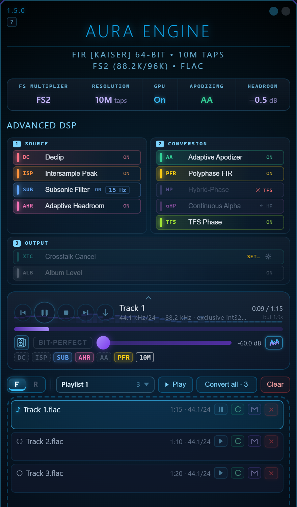

**AuraEngine** takes ordinary 44.1/48 kHz FLAC/WAV/MP3 files and re-renders
them at up to **768 kHz / 24-bit FLAC**, using FIR filters of
**5 thousand to 30 million taps** whose coefficients are designed in **128-bit
precision**. It spends the math your DAC's built-in interpolation filter never
could: the DAC then receives an already-reconstructed, oversampled waveform and
only has to play it.

**It converts, and it plays — one engine, one chain.** Every file in the list
has ▶ beside **C**, its convert button, and internet radio plays through the
same rack. The converter takes as long as it needs and writes a file; the
player prepares ahead what needs the whole track and switches each stage in as
soon as it is ready, and neither trades sound for speed without saying so —
[one engine, two ways to use it](#one-engine-two-ways-to-use-it). A live
analyzer and scenes that draw the music come with it.

Everything the engine does is **verifiable by design**: the full DSP trace is
logged to the console, every output file is re-decoded and compared
sample-by-sample against the internal f64 buffer, and files that fail
verification are renamed `_UNVERIFIED` instead of being silently kept.

**Highlights**

- **⭐ The Hybrid-Phase engine — the signature invention of this project.**
  The track is rendered **twice in full** (linear phase + minimum phase) and an
  onset detector switches between the two renders per-attack, stereo-linked, at
  zero crossings. No pre-ringing ahead of the attacks it fires on, stereo image
  intact everywhere else —
  [see it animated below](#the-hybrid-phase-engine--why-this-exists).
- **A player on the same chain** — ▶ on any file plays it through the rack it
  would be converted with; a seek, the next track or a change in the rack never
  cuts the sound, and badges under the player show which stages are already in
  it. What it sends to the device and the converted file differ by less than
  −120 dB once every stage is in — [the player](#the-player).
- **Internet radio through the rack** — featured stations, a catalog of tens
  of thousands to search, or any stream's address: MP3, AAC, HE-AAC, FLAC,
  Vorbis, Opus and HLS, upsampled live. A dropped connection comes back
  without a seam, and long filters do not make a stream wait —
  [internet radio](#internet-radio).
- **Massive FIR upsampling** — per-ratio Kaiser filters from 5k to 30M taps
  (β = 14 from 1M up, fitted to the length at 5k), measured stopband down to
  **−221 dB**, designed offline in 128-bit precision
  and applied in end-to-end **f64** with Kahan-compensated summation.
- **Adaptive apodizer v3 — source forensics** — measures the exact *frequency*
  of the ADC/SRC pre-ring baked into a master and places a minimum-phase
  corrective lowpass just below it; unmasks fake hi-res (upsampled masters,
  including mirror-image aliasing from bad resamplers) at any container rate;
  leaves clean and minimum-phase sources untouched.
- **GPU acceleration with no precision loss** — convolution runs on Vulkan
  compute in **double-single (DS) arithmetic** (~48-bit effective mantissa,
  ~−260 dB residual vs f64), enforced at the SPIR-V level with
  `NoContraction` so the driver cannot fold it back to f32.
- **True-peak safety, album by album** — 4× Lanczos-4 intersample peak scan
  with a −0.5 dBTP ceiling, applied only when needed; quiet material passes
  bit-exact. With **Album Level** the tracks of one album share one gain, so
  the album keeps the balance it was mastered with.
- **Honest output** — 24-bit TPDF dither (Wannamaker-9 noise shaping at
  ≤48 kHz), then a **bit-perfect re-decode verification** of every FLAC.
- **No external tools** — decoding and FLAC encoding are both pure Rust, and
  no subprocess is started during a conversion. The encoder streams frames to
  disk as they fill, so a 90-minute file costs the same peak RAM as a
  three-minute one.
- **It stops rather than substituting** — if the filter a setting needs is not
  on disk, the conversion fails and names the exact file, before it starts.
  It will not quietly fall back to an ordinary resampler while the interface
  still says "30M Taps".
- **An analyzer, and pictures** — loudness, LRA, true peak and DR of the
  source and the output side by side, with spectrograms that compare them; and
  19 GLSL scenes that draw the music, three of them each instrument on its own
  — [the analyzer](#the-analyzer), [visualizations](#visualizations).

<br clear="right"/>

## One engine, two ways to use it

The question is not offline against real time. There is one engine and one
chain, and it does not quietly give up sound for speed. The converter has no
deadline. The player prepares ahead what a track needs whole and switches each
stage in as soon as it is ready — the badges show which are in — and once every
stage is in, what it sends to the device matches the converted file to −120 dB
(measured on 30M taps, FS×8, TFS, XTC). When the machine cannot keep up, the
player moves the convolution to the graphics card, then steps the tap count
down, and says so. A live stream has no future to read ahead into: only the two
stages that need the whole track, Declip and the Adaptive Apodizer, stand down
there, and the interface shows it.

| | Converter | Player — a file | Player — a stream |
|---|---|---|---|
| **Chain** | The whole rack, every stage at full length | The same rack; the source stages prepared ahead over the whole track | The same rack, as the stream arrives; linear phase looks 50 ms ahead |
| **Whole-track stages** | All of them, before anything is written | All of them — switched in as they get ready, or all before the first sound with Instant start off | Declip and the Adaptive Apodizer stand down; the level follows a slow gain under the same ceiling |
| **Album Level** | One level for the tracks of an album | Each track at its own level | — |
| **Hardware** | Any machine: 10M or 30M taps at a high FS just take longer | Real time on the CPU, or on a discrete graphics card; if neither keeps up, fewer taps for that track, and the taps chip says so | As for a file |
| **Output** | A 24-bit FLAC, re-decoded and checked against the f64 render | WASAPI exclusive at the output rate, or BIT-PERFECT | The same |
| **Best for** | Music to keep and play anywhere | Hearing a setting before converting; listening at once | Internet radio |

**Why convert, when the player matches it?** Any filter runs on any machine —
10M or 30M taps at a high FS just take longer. Album Level gives an album one
level, and that needs every track at once; the player plays each track at its
own. The file plays anywhere — a player, a streamer, a phone, no PC needed.
Listening to it costs no CPU and has nothing to keep up with. And the file is
checked against the f64 render it came from.

**Why play?** To hear a setting before an evening goes into converting with it;
to listen at once, without disk space spent on hi-res copies; and for radio —
a stream cannot be converted, so the player is the one way to put it through
the chain.

## Download

**The filters are already inside.** Unzip, run `aura-engine.exe`, drop a track
on the window: ▶ plays it, **C** converts it. No Python, no Rust, no second
download, no folder to create — the app opens on the filter that shipped with
it and works immediately.

| Bundle | Filter | Output rates | Size | |
|---|---|---|---|---|
| **Compact** | 5k taps | every multiplier — FS2 to FS16 | ~12 MB | [**Download**](https://github.com/ToxaDev/aura-engine/releases/download/v1.5.1/aura-engine-v1.5.1-bundle-5k-windows-x64.zip) |
| **Starter** | 1M taps | every multiplier — FS2 to FS16 | ~140 MB | [**Download**](https://github.com/ToxaDev/aura-engine/releases/download/v1.5.1/aura-engine-v1.5.1-bundle-1M-windows-x64.zip) |
| **Standard** — *start here* | 10M taps | FS8 — 352.8 / 384 kHz | ~332 MB | [**Download**](https://github.com/ToxaDev/aura-engine/releases/download/v1.5.1/aura-engine-v1.5.1-bundle-10M-windows-x64.zip) |
| **Reference** | 30M taps | FS8 — 352.8 / 384 kHz | ~972 MB | [**Download**](https://github.com/ToxaDev/aura-engine/releases/download/v1.5.1/aura-engine-v1.5.1-bundle-30M-windows-x64.zip) |

These point at the current release. The
[releases page](https://github.com/ToxaDev/aura-engine/releases/latest) always
has the newest one, whatever this table says.

Every bundle carries **both phase types**, so Hybrid-Phase works out of the
box, and **both rate families**, so 44.1 and 48 kHz sources convert alike.

**What it needs**

| | |
|---|---|
| Windows | 10 or 11, 64-bit |
| CPU | AVX2 — Intel Haswell (2013) or AMD Excavator (2015) and newer |
| Runtime | [Microsoft Edge WebView2](https://developer.microsoft.com/microsoft-edge/webview2/). Windows 11 has it already; Windows 10 often does not, and the LTSC and N editions never do |
| Audio output *(for playback)* | Opened in WASAPI exclusive mode at the output rate: nothing else can play through the device at the same time, and it must accept that rate — FS×8 is 352.8 / 384 kHz, and a DAC that does not take it needs a lower FS multiplier. Converting needs no audio device. |
| Internet *(for radio)* | Any connection a stream plays on. The station catalog is [Radio Browser](https://www.radio-browser.info/). |
| Graphics card *(optional)* | Vulkan with SPIR-V passthrough. Conversion uses any such card; playback uses a discrete one, and only when the CPU cannot keep up. Without one, everything runs on the CPU. |
| Disk *(optional)* | For the visualizations with instruments: a 282 MB model pack, downloaded once, when such a scene is first chosen — 374 MB installed, 724 MB free while it installs. |

**Updates install themselves from 1.5.0 on.** At start the app looks for a
newer release and offers it; the download is checked against a signature over
its version tag, file name and SHA-256 before anything is written, and the app
restarts into the new version. It will not update while a conversion is
running. 1.3.4 and earlier have no updater — install 1.5.0 from this page once;
your settings are kept.

**If nothing happens when you run it**, open a command prompt in the folder and
run `aura-engine.exe --selftest`. It prints what the build needs against what
your machine has, and writes `AuraEngine-crash.txt` next to the exe. That file
is enough to tell us why — [open an issue](https://github.com/ToxaDev/aura-engine/issues)
and attach it. From 1.2.3 the program also says so in a window of its own
rather than closing without a word, and where the cure is a download it offers
to open it.

Which one? The tap count sets how steep the wall at the cutoff is, and how long
the conversion takes. It is a setting with a ceiling, not a quality tier: on the
magnitude response there is nothing in thirty million taps that five thousand
with a wider window cannot do, and on music a 5k and a 30M render agree below
20 kHz — what differs is the last kilohertz of the CD band
([measured](docs/12-precomputed-fir-matrix.md#short)). 10M at FS8 is where to
start. 5k is the smallest download: its filters for every multiplier take under
a megabyte. 1M carries every multiplier in a download small enough for a phone
tether, and 30M is the longest filter the engine designs.

> **Comparing them is the point.** Unzip more than one bundle into the same
> folder: the filter files merge, one copy of the app serves all of them, and
> the tap slider then offers every size you have. Convert the same track at 5k
> and at 30M and listen to what a tap count actually buys.

<details>
<summary><b>Just the app, or just the filters</b> — for people who already have blobs, or want a size we don't bundle</summary>

<br>

| Asset | What it is | Size |
|---|---|---|
| [`aura-engine-v1.5.1-windows-x64.zip`](https://github.com/ToxaDev/aura-engine/releases/download/v1.5.1/aura-engine-v1.5.1-windows-x64.zip) | The app alone. Needs filters from somewhere. | ~12 MB |
| [`aura-filters-5k-all-rates.zip`](https://github.com/ToxaDev/aura-engine/releases/download/v1.0.0/aura-filters-5k-all-rates.zip) | 5k taps, all 8 output rates, both phases | 645 KB |
| [`aura-filters-1M-all-rates.zip`](https://github.com/ToxaDev/aura-engine/releases/download/v1.0.0/aura-filters-1M-all-rates.zip) | 1M taps, all 8 output rates, both phases | 128 MB |
| [`aura-filters-5M-all-rates.zip`](https://github.com/ToxaDev/aura-engine/releases/download/v1.0.0/aura-filters-5M-all-rates.zip) | 5M taps, all 8 output rates, both phases | 640 MB |
| [`aura-filters-10M-all-rates.zip`](https://github.com/ToxaDev/aura-engine/releases/download/v1.0.0/aura-filters-10M-all-rates.zip) | 10M taps, all 8 output rates, both phases | 1.28 GB |
| [`aura-filters-30M-44k-family.zip`](https://github.com/ToxaDev/aura-engine/releases/download/v1.0.0/aura-filters-30M-44k-family.zip) | 30M taps, 88.2 / 176.4 / 352.8 / 705.6 kHz | 1.92 GB |
| [`aura-filters-30M-48k-family.zip`](https://github.com/ToxaDev/aura-engine/releases/download/v1.0.0/aura-filters-30M-48k-family.zip) | 30M taps, 96 / 192 / 384 / 768 kHz | 1.92 GB |

Filter packs contain only `.npy` blobs in a `fir-optimizer/output/` folder —
extract one next to `aura-engine.exe` and it is found. `AURA_FILTER_DIR` points
the app at a folder anywhere else. The 30M blobs are split by rate family
because one archive for all of them would exceed GitHub's per-file limit.

Whatever you end up with, the app adapts: it scans for blobs at startup, opens
on the largest filter it found at FS8, strikes through the slider positions it
has nothing for, and names the exact download for the one you select.

</details>

## The player

Each row of the list has four buttons: **▶** plays the file, **C** converts it
with the rack as it is now, **M** gives the track a memory of its own, and **✕**
takes it off the list. The player — the strip above the list, with previous,
play/pause, stop, next, repeat, a seek bar, the output device, **BIT-PERFECT**,
the volume and the analyzer — runs the chain the file would be converted with:
the same filter, the same phase engine, the same rack and output stages. A
batch can run while it plays. A row that has been converted with the current
rack plays its file from disk, and its ▶ turns green. Measured on one chain
(30M taps, FS×8, TFS, XTC), the samples the player sends to the device and the
converted file differ by less than −120 dB once every stage is in.

<p align="center">
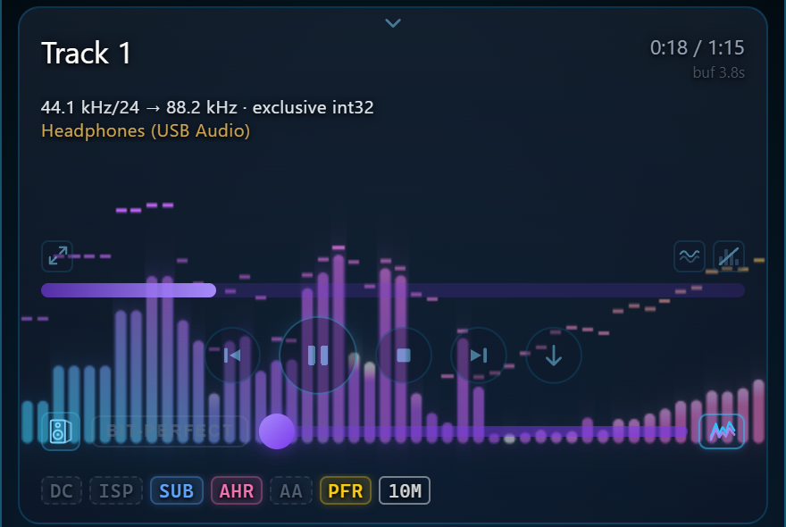
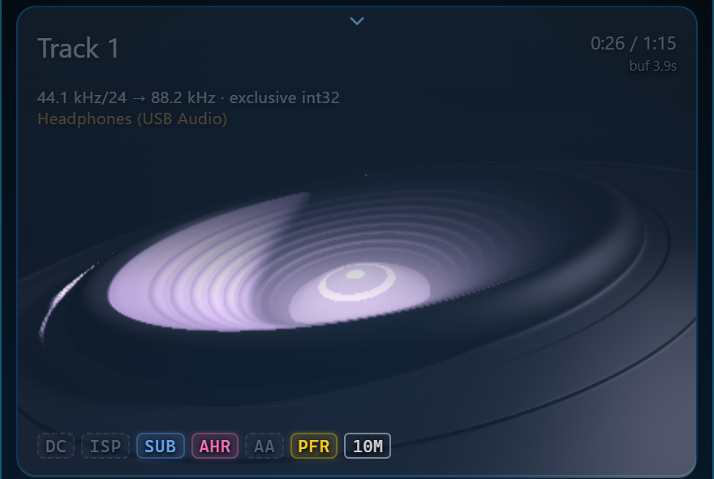
</p>

**Nothing cuts the sound.** A seek keeps the old place playing until the new
one is ready, then crossfades into it. The next track is prepared while the
current one plays and follows it without a gap; when it belongs to the other
rate family (44.1 against 48 kHz), the only pause is the device reopening at
the new rate, about 0.6 s. A change in the rack goes out 1.5 s after the last
click, so ten quick clicks make one rebuild, and the new chain is built while
the old one plays.

**What is in the sound, and when.** Some stages need the whole track before
they can decide anything. By default the sound starts at once with most of the
rack already in it — Declip, ISP, the Subsonic Filter and Adaptive Headroom run
over the track as it is decoded, ahead of what you hear — and the badges under
the player light as the rest switch in, while a thin bar beneath them fills
until everything is on. **Instant start**, in the player's right-click menu,
is the switch: off, nothing plays until every stage is ready, and the first
sound after a start, a seek, a new track or a rack change already has all of
them.

**On the graphics card.** The player measures, on your machine and for the
chosen filter, whether the CPU can convolve in real time with room to spare,
and moves the convolution to a discrete graphics card when it cannot. On an
RTX 4090, 30M taps take about 0.6 GB of video memory, a Hybrid-Phase pair
1.2 GB, and the result matches the CPU's to −280 dBFS. If neither can keep up,
the tap count steps down once for that track, and the taps chip says so.

**The output.** The device is opened in WASAPI exclusive mode at the output
rate. What goes to it is checked after the volume control, and a block more
than 12 dB louder than the volume allows is replaced by silence.
**BIT-PERFECT** sends the decoded file instead — at its own rate and depth (a
lossy one as the widest integer format the device takes), without the rack,
the volume or dither — and switches on and off while a track plays.

| Control | What it does |
|---|---|
| **F / R** | At the head of the list: switches it between your files and internet radio. What is playing goes on; the letter of the other view breathes while something plays there. |
| **▶ C M ✕** on a row | Play the file through the rack, convert it, give it a memory, take it off the list. A double-click plays it too. |
| **Convert all** | Converts every row not yet converted with the current rack. Fills as the batch runs and ends with `✓ <audio> · ×N` — the length of audio converted and how many times faster than real time it went; its tooltip lists the files, the first twelve by name. Hold it for two seconds to cancel. A finished row shows its own ×N beside its ✓. |
| **M** | Track memory: the rack, Headroom and Apodizing for this file — Declip, ISP, the Subsonic Filter and its corner, Adaptive Headroom, the Adaptive Apodizer, Hybrid-Phase, Continuous Alpha, TFS, XTC and its geometry. They come back when the track plays or converts. FS multiplier, resolution and GPU stay global. |
| **BIT-PERFECT** | The decoded file goes to the device untouched, without the rack or the volume. Switches while a track plays; works on radio too. |
| **Badges under the player** | One per stage of the rack. Lit means it is in the sound now; a thin bar under them fills while the rack switches in and goes when every stage is on. Chips beside them name the taps playing, the graphics card, M, and DISK for a converted file played from disk. |
| **Instant start** *(right-click menu)* | On (default): the sound starts at once and the stages switch in as they get ready. Off: every stage is prepared first. |
| **L** | Listening mode: the settings fold away, and the player and the list take the window. When the pointer leaves a playing player, the album cover shows with the artist, the album and the year. |
| **Ctrl+Shift+A** | The live analyzer: what you hear now. A row's right-click menu opens it on the file, or on its converted copy. |
| **Visualization** *(right-click menu in listening mode)* | Scenes by name, the album cover, or off; Spectrum bars, Full screen, Picture delay (per output device), and the Studio for writing your own scene. |
| **?** *(below the version number)* | A short tour of the window, zone by zone. It is offered once, at first start. |

How a chain is prepared, what each badge state means and how the graphics card
is chosen: [docs/19 — The Player and Internet Radio](docs/19-player-and-radio.md).

## Internet radio

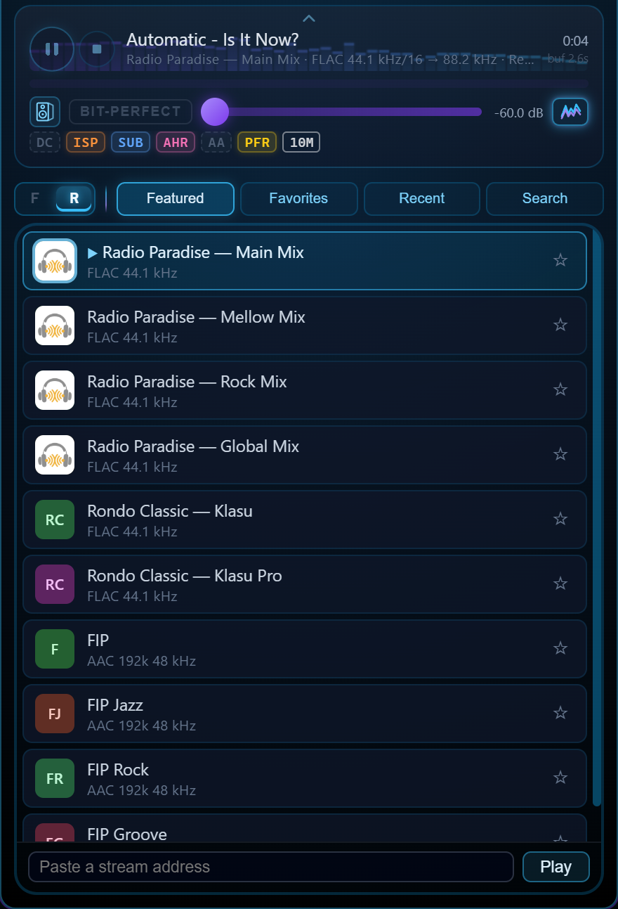

**F / R** at the head of the list switches it to the radio: featured stations,
your favorites and the ones you played recently, a search of the
[Radio Browser](https://www.radio-browser.info/) catalog — tens of thousands of
stations by name, genre, country, language and format, sorted by name, votes,
plays or quality, and filtered down to lossless or a minimum bitrate — and a
field for any stream's address. On a stream the player keeps play and stop
only — another station is a click in the list — and the title of what is
playing changes when you hear the new song, not when the server announces it.

It plays MP3, AAC and HE-AAC, FLAC (also in Ogg), Vorbis and Opus, from plain
HTTP streams, .pls and .m3u playlists and HLS. HE-AAC and Opus are decoded
inside the program, so they play on every edition of Windows. Streams at 44.1
or 48 kHz and their multiples are upsampled; an encrypted HLS stream does not
play. A service that does not allow third-party players is left out of the
catalog.

A live stream has no whole track, so the two stages that need one stand down:
Declip and the Adaptive Apodizer are grey on a stream. Everything else runs as
the stream arrives — DC removal (as a 2 Hz high-pass), ISP, the Subsonic
Filter, the phase engine (TFS, Hybrid-Phase and Continuous Alpha from the first
sound), XTC and the output limiter — and Adaptive Headroom decides on the
stream's first ten seconds. **Long filters do not make a stream wait.** A
linear-phase filter needs half its length of signal ahead of it — 42 s at 30M
taps and FS×8, which no broadcast can give — so a stream plays a version of
the same filter that looks 50 ms ahead: the same magnitude and stopband, linear
phase up to 20 kHz and minimum phase in the last kilohertz under the wall. It
is derived from the shipped filters the first time a length plays on a stream,
and kept beside them.

When the connection drops, the player reconnects, finds where the new
connection repeats what it already has, and skips the repeat, so the music goes
on without a seam. The buffer starts at 8 seconds and grows when the network
leaves it empty. The server's clock and the DAC's never quite agree; the player
keeps the buffer within a second of where it should be by dropping or repeating
a few milliseconds in a quiet place, with nothing resampled. **BIT-PERFECT**
works on a stream too: a FLAC station reaches the DAC at its own depth, a lossy
one as the widest integer format the device takes.

Upsampling cannot add what the codec removed: a 128 kbps MP3 stream stays a
128 kbps MP3, played through a better reconstruction filter. Stations that
stream FLAC are where the rack has the most to work with. Details:
[docs/19 §2](docs/19-player-and-radio.md#2-internet-radio).

## The analyzer

A window of its own. **Ctrl+Shift+A** opens it on what you hear now; a row's
right-click menu opens it on the file as it is, or on its converted copy. It
measures three signals side by side — **S**, the source; **B**, the source
after the rack's repair stages, before the filter; **O**, the output of the
whole chain, from a pass over the entire track — with integrated, short-term
and momentary loudness, LRA, true peak (BS.1770 and the engine's own 4×
reading), DR, RMS, clipping runs and overs, DC offset, and what lies above and
below the audio band.

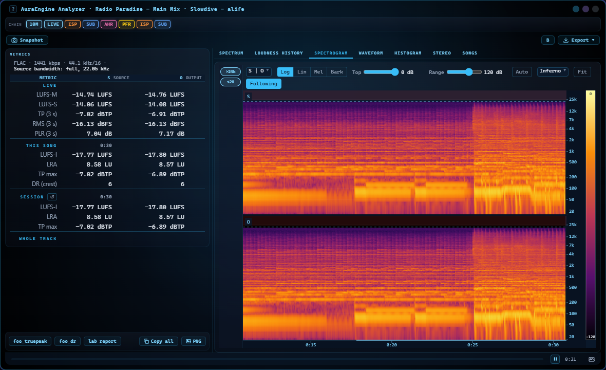

The spectrogram — a 4096-point FFT at 44.1/48 kHz with a Kaiser window, 512
logarithmic bands from 20 Hz to Nyquist, three resolutions blended; Log, Lin,
Mel and Bark scales, four colour maps — compares the signals directly: S | O,
O − S (blue quieter, red louder) and B − S, with a readout in Hz, note name,
level and time. Shift-drag on it selects a stretch, and the table measures that
stretch alone. The spectrum, the loudness history, the waveform (down to single
samples, following the playback, with the peaks of S and O read under the
pointer), a histogram and a stereo view with a
vectorscope and correlation have tabs of their own. The numbers copy as text in
the formats forums use for DR and true-peak reports, or save as TSV; the
loudness history saves as CSV, and any view as PNG. The whole-track passes run
only while the analyzer is open, so playback without it costs no extra CPU. On
a radio stream it measures the stream as it came in (S) and the output (O)
live, totals them for the song playing and for the session (↺ starts it
afresh), lists the songs heard, and shows how far the stream's spectrum really
reaches — an MP3 at 128 kbps ends near 16 kHz, a lossless stream reaches half
its sample rate. Its views keep what has played — about three minutes of the
spectrogram, 30 minutes of the loudness and of the waveform, with a minimap —
and follow the live edge until you zoom in or look back; the histogram and the
stereo view give the song's and the session's, and the stream's loudness saves
as CSV. In BIT-PERFECT one set of numbers stands for both: the output is the
source.

## Visualizations

In listening mode the player can draw the music. A scene is a GLSL shader in an
`.aura-vis` file: 19 come with the app, and the **studio** (Visualization ›
Studio…) edits them, tunes their settings with sliders and saves new ones. It
takes Shadertoy's multipass shaders — one pasted in keeps its author, link and
licence — with the album cover as one of the inputs. Because the player renders
a few seconds ahead of what you hear, a scene can see what is coming: it can
show a kick on its way and have it land as it sounds. How to write one is set
out in the specification that comes with the app,
[`AURA-VIS-SPEC.md`](desktop-app/src/vis/AURA-VIS-SPEC.md).

Most scenes draw the whole mix — its spectrum, beats and loudness. Three, the
ones **with instruments** (Stage, Lineup, Diamond Dust Stage), draw each
instrument of the song on its own: the kit piece by piece, the bass, the voice
and the rest, with their hits and notes. They need a pack of models the app
does not carry — 282 MB, downloaded once when such a scene is first chosen,
and checked file by file before anything in it is used — and each track is
analysed once, in the background, and kept; on an RTX 4090 a four-minute track
takes 15–25 seconds. The separation wants a graphics card with 3 GB of video
memory free; without one the CPU does it, and the drum kit is then told apart
only by its bands. On a radio stream the instruments are found as the stream
plays: it is taken apart on the graphics card a little ahead of what you hear,
so they come a few seconds after a station starts, and each song's picture
gains instruments as they join in. The kit comes piece by piece — the toms and
the cymbals once they play — where the card has room for the drum network
beside the separation (about 1.5 GB more of free memory); otherwise it is kick,
snare and hi-hat taken from the drums' sound. Every instrument but the drums
has its notes about two seconds before it sounds, and on a file and a stream
alike it flashes on its strong notes. At first the notes of the guitars, the
keys and the rest go to their places by pan; once their source has played some
forty strong notes in the song, it is split into its instruments by their
notes, as on a file, and each place is taken over by the instrument nearest to
it, which keeps its slot and changes its colour once. Until the instruments are
there, the scene draws the mix and says so ("Separating instruments…"); without
a graphics card, or without enough of its memory free, it shows the mix and
says why.

<p align="center">
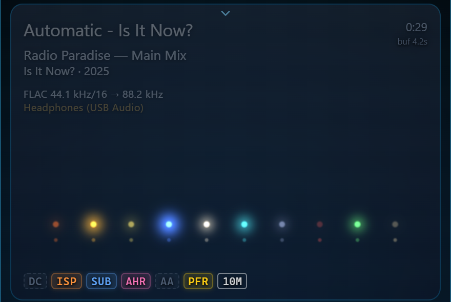
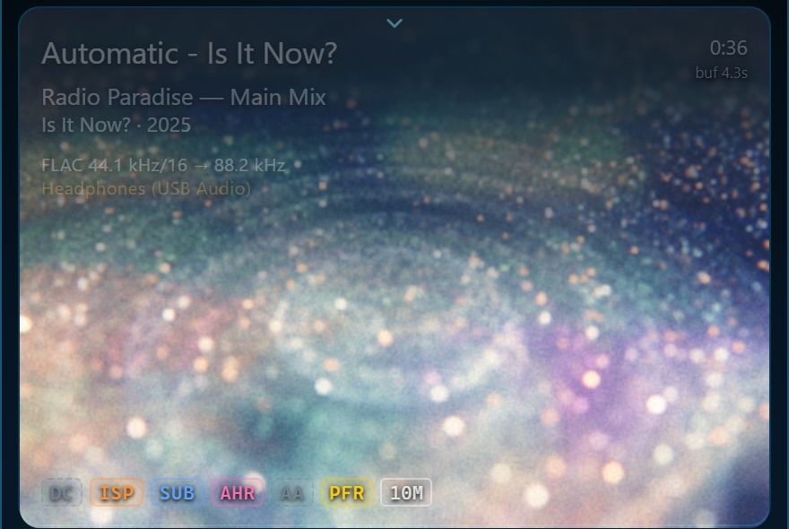
</p>

**Picture delay**, per output device, holds the bars and the scenes back by the
time a DAC's own filter or active speakers add and Windows does not report.

## The Hybrid-Phase engine — why this exists

<p align="center">
  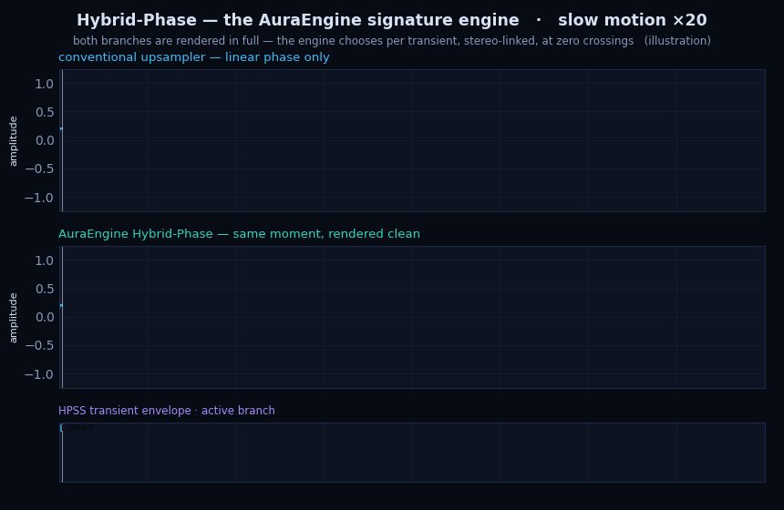
</p>

Every FIR filter forces a trade. **Linear phase** keeps inter-channel timing
perfect — the stereo image stays holographic — but it *pre-rings*: a faint
anticipatory smear arrives **before** every drum hit. **Minimum phase** hits
perfectly clean, but warps timing across frequencies. The industry's usual
answer is a fixed "intermediate-phase" compromise filter — which simply
carries a little of both flaws, everywhere, all the time.

**Hybrid-Phase refuses the trade.** AuraEngine renders the track **twice, in
full** — one complete linear-phase pass and one complete minimum-phase pass —
then a native-Rust HPSS transient detector decides, moment by moment, which
render you hear: linear phase through sustains and decays (imaging),
minimum phase through attacks (zero pre-ringing). The switch itself is
engineered to be inaudible:

- fires only at a **zero crossing of the mid signal**;
- **stereo-linked** — one switch plan applied to both channels at the same
  sample, so the image can never skew;
- 1 ms fade on a smooth curve + 20 ms anti-chatter hold;
- both renders aligned sample-exact via band-weighted group delay before
  blending.

**What the detector keys on, precisely.** It measures the rise of percussive
energy between analysis frames — the *start of a sound*. It does not measure
whether the filter would ring on this material; it knows nothing about the
transition band. On music the two coincide, because an attack is both a
beginning and a broadband event. On synthetic material they come apart: a
steady square wave with arbitrarily steep edges produces no trigger at all,
because nothing begins. So the honest name for the stage is *minimum phase on
attacks*, and there is a known blind spot in the first ~24 ms of a file — both
are written up, with the numbers, in
[docs/06-hybrid-phase-proof.md §1](docs/06-hybrid-phase-proof.md).

This technique was invented for AuraEngine. We are not aware of any other
converter that does content-aware switching between two complete phase
renders — if you know one, open an issue: we would genuinely love to compare
notes. The verification methodology is documented in
[docs/06-hybrid-phase-proof.md](docs/06-hybrid-phase-proof.md).

## The signal path

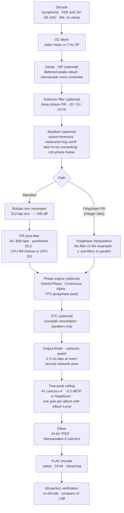
```mermaid
flowchart TD
    A["Decode<br/><i>Symphonia · FDK AAC for HE-AAC · f64, no clamp</i>"] --> B["DC block<br/><i>static mean or 2 Hz IIR</i>"]
    B --> C["Declip · ISP (optional)<br/><i>flattened peaks rebuilt ·<br/>intersample overs corrected</i>"]
    C --> S["Subsonic filter (optional)<br/><i>linear-phase FIR · 20 / 15 / 10 Hz</i>"]
    S --> D["Apodizer (optional)<br/><i>source forensics: measured ring cutoff ·<br/>fake-hi-res unmasking · min-phase Kaiser</i>"]
    D --> E{Path}
    E -->|Standard| F["Rubato sinc resampler<br/><i>512-tap sinc · ~−180 dB</i>"]
    F --> G["FIR post-filter<br/><i>5k–30M taps · partitioned OLS ·<br/>CPU f64+Kahan or GPU DS</i>"]
    E -->|"Polyphase FIR<br/>(integer ratio)"| H["Polyphase interpolation<br/><i>the filter IS the resampler ·<br/>L sub-filters in parallel</i>"]
    G --> I["Phase engine (optional)<br/><i>Hybrid-Phase · Continuous Alpha ·<br/>TFS (polyphase path)</i>"]
    H --> I
    I --> X["XTC (optional)<br/><i>crosstalk cancellation · speakers only</i>"]
    X --> L["Output limiter · subsonic guard<br/><i>~1.5 ms dips at overs ·<br/>second subsonic pass</i>"]
    L --> J["True-peak ceiling<br/><i>4× Lanczos-4 · −0.5 dBTP or Headroom ·<br/>one gain per album with Album Level</i>"]
    J --> K["Dither<br/><i>24-bit TPDF · Wannamaker-9 ≤48 kHz</i>"]
    K --> M["FLAC encode<br/><i>native · 24-bit · streaming</i>"]
    M --> V["Bit-perfect verification<br/><i>re-decode · compare ±2 LSB</i>"]
```

Two conversion paths share the same preparation and output stages:

| | Standard path | Polyphase FIR path |
|---|---|---|
| Resampler | Rubato `SincFixedIn` (512-tap sinc), then the big FIR as a post-filter | The big FIR **is** the resampler — decomposed into L sub-filters running in parallel |
| Ratios | Any | Integer only (non-integer targets snap down: 44.1 kHz → FS8 gives 352.8 kHz) |
| Trailing padding | ~0.4 s of resampler zero-pad | None — output length is exactly input × L |
| TFS Phase | Stands down, and the row says so | Runs |
| Filter blobs missing | Post-filter skipped with a warning | Hard error (by design — no silent quality downgrade) |

The player runs this chain live: the source stages prepared ahead over the
whole track, then the polyphase FIR, the phase engine and the output stages as
it plays. A detailed, beautifully rendered walkthrough of every stage lives at
**[toxadev.github.io/aura-engine](https://toxadev.github.io/aura-engine/)**
(source: [docs/index.html](docs/index.html)), and the same material as plain
markdown starts at **[docs/README.md](docs/README.md)**. The engineering laws the DSP core is
audited against are in **[DSP_MANIFESTO.md](DSP_MANIFESTO.md)**.

## Build from source (Windows)

> Only needed if you want to change the engine. To *use* it, take a
> [bundle](#download) — there is nothing to install and nothing to compile.

> AuraEngine is developed and tested on **Windows 11** (Windows 10 should
> work but is untested). Linux/macOS are currently not supported — the build
> uses the MSVC toolchain and Win32 APIs for audio output (WASAPI), the
> video-memory budget, thread priority and timer resolution.

### 1. Prerequisites

| Requirement | Why | Notes |
|---|---|---|
| [Rust](https://rustup.rs/) 1.88 or newer (MSVC) | builds the app | fat LTO |
| [CMake](https://cmake.org/) 3.16 or newer | builds libopus from source | for the radio's Opus streams |
| [Python 3.10+](https://www.python.org/) with `numpy scipy mpmath soundfile` | generates the FIR filters | one-time step |
| WebView2 runtime | Tauri UI | ships with Windows 11 |
| Vulkan-capable GPU *(optional)* | GPU DS convolution path | falls back to CPU automatically — no adapter, or out of video memory; playback uses a discrete card only |

### 2. Clone and build

```bat
git clone https://github.com/ToxaDev/aura-engine.git
cd aura-engine\desktop-app
start.bat
```

`start.bat` compiles the release binary on first run and launches it.
Subsequent runs skip cargo entirely when nothing changed (instant start);
`start.bat --build` forces a rebuild, `--clean` wipes the build cache.
No Node.js, no npm, no Tauri CLI — the frontend is static HTML/JS embedded
into the binary.

### 3. Get the FIR filters (one-time)

The converter loads pre-computed filter coefficient files (`.npy`) —
it deliberately refuses to synthesize filters at runtime, because runtime
generation could not match the 128-bit design precision.

**Easiest way:** grab a [filter pack](#download) and extract it into the
repo folder. The archives already contain the `fir-optimizer/output/`
structure, so nothing has to be moved afterwards.

**Or generate them yourself:**

```bat
cd ..\fir-optimizer
pip install -r requirements.txt
python optimize.py --all-ratios
```

`--all-ratios` populates `fir-optimizer/output/` with the full matrix —
4 tap sizes × 8 output rates × 2 phase types = 64 files, roughly **10 GB**,
and it can take a while for the 30M presets. It skips files that already
exist, so you can interrupt and resume. If you only care about one preset,
see [fir-optimizer/README.md](fir-optimizer/README.md) for generating a
subset. Store the blobs anywhere by setting the `AURA_FILTER_DIR`
environment variable to the folder that contains them.

Whatever subset you end up with, the app works out what it has at startup:
it opens on the largest tap count it found at FS8, strikes through the
slider positions with no blob behind them, and names the download for one
you select anyway. [`tools/make-bundles.ps1`](tools/make-bundles.ps1) builds
the app-plus-filters packages that appear on the release page.

### 4. Convert, or play

1. Launch the app (`start.bat`).
2. In the strip at the top of the window, set the **FS Multiplier** (FS2–FS16)
   and the **Resolution** (5k–30M taps).
3. Optionally switch stages on or off in **Advanced DSP**, below the list —
   Subsonic Filter, Adaptive Apodizer, Polyphase FIR Resampling, Hybrid-Phase,
   XTC, Album Level and the rest — or **GPU** in the strip.
4. Drop files onto the window — they join the list. **C** on a row converts
   it, **Convert all** converts every row not converted yet, and **▶** plays a
   row through the same chain.
5. The output FLAC appears **next to the source file**, named like:

```
Track [AE · 44.1k→352.8k · Kaiser 10M · f64 · SUB15·AA·PFR·TFS].flac
```

The bracket lists the stages that ran, in the order they ran. A
`✓ VERIFIED` badge means the written FLAC was re-decoded and matched the
internal DSP buffer within ±2 LSB. A console window runs alongside the UI on
purpose — it is the engine's full audit log (filter resolution, hybrid-phase
coverage, true-peak decisions, verification results). It starts minimized;
the taskbar brings it up.

## Controls reference

The five main settings — FS Multiplier, Resolution, GPU, Apodizing,
Headroom — sit in a strip at the top of the window; a click on a cell opens
its control, and GPU switches at once. Advanced DSP is below the list.

| Control | What it does |
|---|---|
| **FS Multiplier** (FS2/4/8/16) | Output rate = source family base × multiplier. 44.1 kHz family → 88.2/176.4/352.8/705.6 kHz; 48 kHz family → 96/192/384/768 kHz. A source above 48 kHz keeps what it holds above the CD band: 96 kHz at FS8 is upsampled ×4, with the filter made for ×4. |
| **Resolution** (5k/1M/5M/10M/30M) | Tap count of the main FIR. More taps → a narrower transition band, at the cost of compute time. The stopband is −185 dB or deeper at every size — the 5k window is fitted to its length — so what length buys is how close to the cutoff the response stays flat. A struck-through mark means this build has no filter file for that size; selecting it names the download that would add it. |
| **Custom filter (.npy)** | In the Resolution cell. Load your own 1-D float64 coefficient file instead of the built-in matrix. |
| **GPU** (Hardware GPU Acceleration) | Runs convolution on Vulkan compute in DS precision. Automatically falls back to CPU (f64) when the adapter lacks `SPIRV_SHADER_PASSTHROUGH` (e.g. DX12-only), and when the card runs out of memory during a batch — per phase on the polyphase path, so the phases already on the GPU stay there. The same switch covers playback, which uses a discrete card, and only when the CPU cannot keep up. |
| **Apodizing** (Off/Gentle/Moderate/Strong) | Static minimum-phase corrective lowpass at 20/19/18 kHz for CD-era sources. Locked off while the Adaptive Apodizer is on. |
| **Headroom** (Off/−0.5/−1/−3 dB) | The true-peak ceiling the finished render is normalised to. `Off` keeps the shipped −0.5 dBTP; −3 dB puts the output peak on −3.0 dBTP. A file already below it is left alone. Opens on −0.5 dB. |
| **Declip** | On by default. Rebuilds peaks a master flattened at full scale, by constrained AR interpolation with the rail as a lower bound. Stands down on runs shorter than 17 samples — that is a limiter, not a clipper — and, since 1.5.0, on MP3, AAC, Vorbis and Opus sources, whose overs are the codec's (tag `DC`). |
| **Intersample Peak Correction** | On by default. Finds true-peak overs above 0 dBTP with a 4× Lanczos scan and applies the smallest correction that clears them, skipping spans Declip has just rebuilt. At the end of the chain a limiter with ~1.5 ms dips trims the overs the reconstruction itself makes, so the whole file doesn't come down for a few milliseconds of peaks (tag `ISP`). |
| **Subsonic Filter** (20/15/10 Hz) | On by default, opening on 15 Hz. A linear-phase FIR high-pass at the source rate, running after the source repairs so a high-pass cannot tilt the flat tops they read: flat within 0.01 dB from the corner up, at least 100 dB down from half the corner to DC. Click the chip on the row to change the corner. It is there for speakers — infrasound and slow drift a disc can carry, which removing the DC offset does not touch — not as a sound improvement (tag `SUB20` / `SUB15` / `SUB10`). With Hybrid-Phase on, the switch points follow the filtered signal. Since 1.3.3 it runs a second time at the output rate, after the ISP output limiter, whose gain dips would otherwise leave a shelf of infrasound about 40 dB under the bass. |
| **Adaptive Headroom** | On by default. Decides whether to honour the Headroom setting on this file: keeps the shipped −0.5 dBTP when the source peak already sits below the target, or when ENOB says the master is a clean high-bit-depth one. Needs Headroom set to something other than `Off` — with nothing requested there is nothing to decide (tag `AHR`). |
| **Adaptive Apodizer** | Per-track source forensics: detects pre-ring and measures its exact frequency, unmasks fake hi-res via spectral-cliff detection and a mirror-image alias probe, and applies a corrective filter only on real evidence. Since 1.5.0 it stands down where its cutoff would sit at or above a lossy codec's wall, where it could only turn the phase (tag `AA`). |
| **Polyphase FIR Resampling** | On by default. The direct path: FIR-as-resampler at integer ratios, exact output length (tag `PFR`). |
| **Hybrid-Phase Blending** | Off by default. Dual linear+minimum-phase convolution with transient-driven switching (tag `HP`, ~2× processing time). Cannot run together with TFS Phase. |
| **Continuous Alpha** | Off by default. Replaces Hybrid-Phase's hard switch with a per-sample crossfade driven by the HPSS envelope. Needs Hybrid-Phase (tag `aHP`). |
| **TFS Phase** | On by default. Linear phase below 1.5 kHz, minimum phase above 4 kHz, blended between; magnitude matches the linear-phase render to ±0.000003 dB. Derived from the linear + minimum pair on first use and cached — at 30M taps about 12 s and 4.5 GB of RAM, once. Since 1.5.0 it is derived as designed (stopband −193 to −231 dB; see the CHANGELOG). Replaces Hybrid-Phase for the file (tag `TFS`). |
| **Crosstalk Cancellation** | Off by default, and the one stage that deliberately colours the signal. Cancels what each speaker sends to the wrong ear, built from a listening triangle you measure. Will not switch on until that geometry is entered. Speakers only, never headphones (tag `XTC`). |
| **Album Level** | On by default. The queued files that share a folder **and** an Album tag are converted as one album: before the first one is written every track is prepared and its true-peak cut estimated, and each takes the deepest of them, so the album keeps the balance it was mastered with. A file without the tag, or the only queued track of its album, converts exactly as before. The queue row shows `ALB`; no filename token. The player plays each track at its own level. |

The rack these live in is three zones — Source, Conversion, Output — with the
stages in each standing in the order the pipeline runs them. Each stage is
described, with measurements, in
[docs/18 — The Advanced DSP Stages](docs/18-dsp-stages.md).

Sources at or below 48 kHz get the full treatment. Hi-res containers skip the
static apodizing presets, but the Adaptive Apodizer analyzes them too: if a
"hi-res" file is really an upsampled 44.1/48 kHz master, the baked-in brickwall
is detected and treated against the *original* Nyquist. Input formats: WAV,
FLAC, MP3, OGG, AAC, M4A (HE-AAC included). Output is always 24-bit FLAC.
Files with non-standard rates are rejected (`BAD`), files already at or above
the target are skipped (`SKIP`).

## How the quality claims are enforced

This project treats sound-quality claims as **testable invariants**, not
marketing. The rules live in [DSP_MANIFESTO.md](DSP_MANIFESTO.md); the
mechanics, briefly:

- **Unity gain**: every filter is DC-normalized (`sum(h) == 1.0`) at design
  time; the converter never changes loudness unless true-peak protection has
  to act.
- **f64 everywhere**: decode writes f64 directly — integer PCM exactly, and
  lossy decoders' samples above full scale kept rather than clipped; there is
  no f32 truncation anywhere in the CPU sample path. The GPU path uses double-single
  f32 pairs (~48-bit mantissa) specifically because plain f32 would not meet
  the noise floor. A radio stream is f64 from the decoder to the filter.
- **Latency-exact alignment**: OLS convolver latency (2 blocks CPU, 1 block
  GPU) and FIR group delay are trimmed analytically — tested by unit tests
  (`cargo test`), not tuned by ear.
- **Bit-perfect verification**: every output file is re-decoded and compared
  against the DSP buffer. More than 900 unit tests cover convolver latency,
  unity gain, polyphase reconstruction, phase alignment, true-peak and dither
  behaviour — and hold the player's streaming stages to the converter's
  whole-file code.

### Measured, not promised

These are measurements of the **actual production filter files** — not
design-tool renderings. Reproduce them with
[`fir-optimizer/plot_measurements.py`](fir-optimizer/plot_measurements.py);
full gallery with methodology in **[docs/15-measurements.md](docs/15-measurements.md)**.

| Quantity (30M taps, 44.1 → 352.8 kHz) | Design law | **Measured** |
|---|---|---|
| Stopband attenuation | ≤ −140 dB | **≤ −220.9 dB** |
| Passband ripple | flat | **± 0.09 nano-dB** |
| DC gain error | 0 | **1.1 × 10⁻¹⁵** |
| Transition width (−6 → −120 dB) | — | **0.05 Hz** (a DAC chip: 2–4 kHz) |

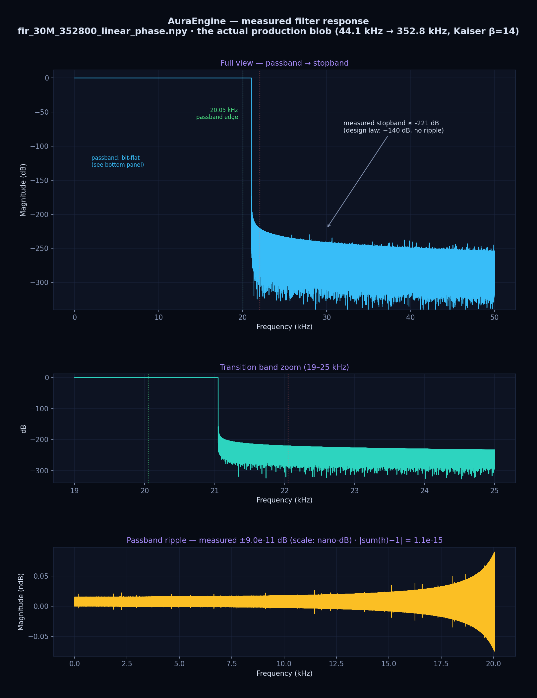

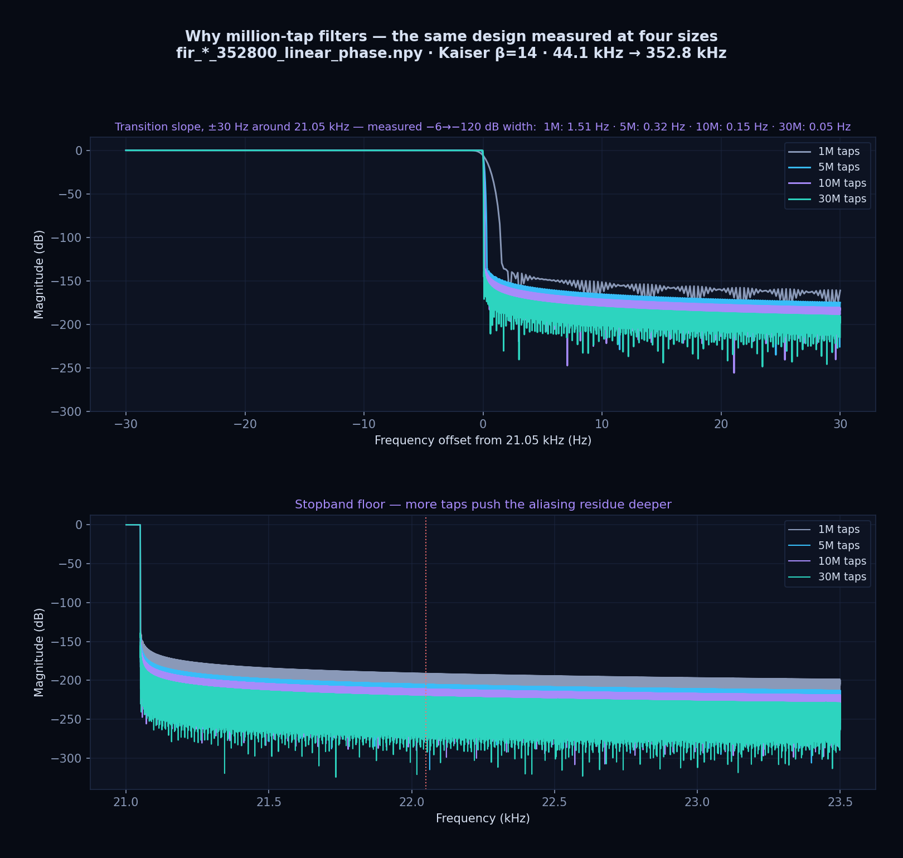

## Documentation

| Document | Contents |
|---|---|
| [The Signal Path (website)](https://toxadev.github.io/aura-engine/) | The full signal path, visually — every stage with its parameters and rationale |
| [docs/19-player-and-radio.md](docs/19-player-and-radio.md) | The player, internet radio, the analyzer and the visualizations — how the conversion chain plays live, and what a stream can and cannot run |
| [docs/18-dsp-stages.md](docs/18-dsp-stages.md) | Every stage in the Advanced DSP rack — declip, intersample peaks, adaptive headroom, TFS phase, crosstalk cancellation, album level — with the measurements behind each |
| [docs/15-measurements.md](docs/15-measurements.md) | Measured frequency/impulse responses of the production filters + how to reproduce them |
| [docs/16-filter-length-and-rate.md](docs/16-filter-length-and-rate.md) | What a tap count means, at which rate — and why 30M taps is not a 10-minute window |
| [docs/17-flac-encoding.md](docs/17-flac-encoding.md) | The native FLAC encoder: streaming design, high-rate handling, and the measured compression settings |
| [docs/01-architecture.md](docs/01-architecture.md) | Data flow, module map, technology stack |
| [docs/05-converter-pipeline.md](docs/05-converter-pipeline.md) | Both processing paths, stage by stage |
| [docs/06-hybrid-phase-proof.md](docs/06-hybrid-phase-proof.md) | Hybrid-Phase engine: detection, switching, verification |
| [docs/07-audiophile-features.md](docs/07-audiophile-features.md) | Each sound-quality feature in plain language |
| [docs/09-audio-auditor-guide.md](docs/09-audio-auditor-guide.md) | Step-by-step signal audit for reviewers |
| [docs/12-precomputed-fir-matrix.md](docs/12-precomputed-fir-matrix.md) | Filter blob naming, lookup, generation |
| [docs/13-pipeline-hardening-2026-07.md](docs/13-pipeline-hardening-2026-07.md) | The 2026-07 correctness audit pass |
| [DSP_MANIFESTO.md](DSP_MANIFESTO.md) | The laws: gain staging, phase, precision |
| [CHANGELOG.md](CHANGELOG.md) | Release history |

## FAQ

**30 million taps ÷ 48 kHz = 10 minutes. Is the filter really that long?**
No — a tap count here is defined at the **output** rate, never at the source
rate. The 30M blob for 44.1 kHz × 8 runs at 352.8 kHz, so its kernel is 85 s
(39 s at 768 kHz), and 99.76 % of its energy lies within ±1 ms of the centre.
Full arithmetic, per-rate table and measured tail decay:
**[docs/16-filter-length-and-rate.md](docs/16-filter-length-and-rate.md)**.

**Offline conversion or real-time playback?**
Both, through one chain — see
[One engine, two ways to use it](#one-engine-two-ways-to-use-it).

**Which radio stations can it play?**
Any stream at 44.1 or 48 kHz (or a multiple) in MP3, AAC, HE-AAC, FLAC,
Vorbis or Opus — over plain HTTP, a .pls or .m3u playlist, or HLS. Encrypted
HLS does not play. Upsampling cannot add what the codec removed: a 128 kbps
MP3 stream stays a 128 kbps MP3, played through a better reconstruction
filter. Stations that stream FLAC are where the rack has the most to work
with.

**Do I really need the GPU?**
No. The CPU path is the reference implementation (f64, Kahan-compensated).
The GPU path exists to make 10M/30M-tap conversions dramatically faster while
staying within ~−260 dB of the CPU result — far below audibility. For playback
it matters only when the CPU cannot run the chosen filter in real time: the
player measures that on your machine, per filter, and uses the card only then.

**Can I run two copies side by side?**
Not since 1.5.0. A second launch brings the open window forward instead of
starting another copy: the player needs the output device to itself, so one
copy runs per machine. Running two copies in parallel to convert faster, as
earlier versions allowed, is no longer possible; within one copy a batch still
converts several files at once.

**Why is there a console window next to the app?**
It is the audit log, and it is intentional. AuraEngine's core promise is that
you can *see* what it did to your audio — filter selection, hybrid-phase
switch coverage, true-peak action, verification verdicts. It starts minimized,
so it stays out of the way until you want it; the same log is written to
`%LOCALAPPDATA%\AuraEngine\logs`.

**Does it need ffmpeg or any other external tool?**
No. Since 1.1.0 both decoding and encoding are pure Rust — Symphonia (and,
since 1.5.0, the FDK AAC decoder for HE-AAC) in, `flacenc` out — and no
subprocess is started during a conversion. The one
remaining exception is *verifying* 705.6/768 kHz output: those rates exceed
the FLAC specification's own 655350 Hz cap, so no pure-Rust decoder will read
them back. Without ffmpeg installed the log says plainly that verification
could not run at that rate, instead of marking a good file `_UNVERIFIED`. See
[docs/17-flac-encoding.md](docs/17-flac-encoding.md).

**Can it damage loudness or dynamics?**
No. The engine applies one gain to a whole file, in one documented place: the
true-peak normaliser, when the reconstructed waveform would exceed the ceiling
— −0.5 dBTP, or whatever Headroom names. With Album Level on, the tracks of one
album share that gain — each takes the deepest cut any of them needs — so their
balance stays as mastered. The only other is the ISP stage's output limiter,
which holds an over with a dip of about 1.5 ms instead of taking the whole file
down. It never raises a quiet file. Everything else is unity-gain by
construction, and the verification step proves the file on disk matches the
math.

## Project structure

```
aura-engine/
├── desktop-app/               # The app (Tauri): converter and player
│   ├── src/                   #   Frontend: static HTML/CSS/JS (no build step)
│   │   └── vis/               #     Visualization scenes (.aura-vis) and their specification
│   ├── src-tauri/             #   Rust backend
│   │   ├── src/audio/         #     DSP core: converter/, gpu/, dsp_core.rs,
│   │   │                      #     hybrid_phase.rs, hpss_native.rs
│   │   ├── src/player/        #     Player: WASAPI output, real-time chain, GPU policy, analyzer
│   │   ├── src/player/radio/  #     Internet radio: network, codecs, joining across reconnects
│   │   ├── src/radio_catalog/ #     Station catalog (Radio Browser), favorites and recent stations
│   │   └── src/spatial/       #     Instrument map for the visualizations (models come as a pack)
│   └── start.bat              #   Build-and-run launcher
├── fir-optimizer/             # Python filter designer (generates .npy blobs)
├── docs/                      # Technical documentation + docs/index.html
├── DSP_MANIFESTO.md           # Engineering laws of the DSP core
└── CHANGELOG.md
```

## Contributing

PRs are welcome — read [CONTRIBUTING.md](CONTRIBUTING.md) first, especially
the part about the [DSP manifesto](DSP_MANIFESTO.md): changes to the audio
path must keep its invariants (unity gain, f64 precision, phase behaviour)
and ship with tests. CI runs `cargo check` + `cargo test` on Windows.

## Acknowledgments

Built on excellent open-source foundations:
[Tauri](https://tauri.app/) · [rustfft](https://crates.io/crates/rustfft) ·
[realfft](https://crates.io/crates/realfft) ·
[rubato](https://crates.io/crates/rubato) ·
[Symphonia](https://crates.io/crates/symphonia) ·
[libopus](https://opus-codec.org/) ·
[FDK AAC](https://android.googlesource.com/platform/external/aac) ·
[wgpu](https://wgpu.rs/) · [rayon](https://crates.io/crates/rayon) ·
[flacenc](https://crates.io/crates/flacenc) · [wasapi](https://crates.io/crates/wasapi) ·
[ort](https://crates.io/crates/ort) · NumPy/SciPy/mpmath. The full list, with
every licence, is in [THIRD-PARTY-NOTICES.txt](THIRD-PARTY-NOTICES.txt).

The radio catalog is [Radio Browser](https://www.radio-browser.info/), a free
and open database of stations, made to be used by players like this one.

Several visualization scenes are adaptations of work published on
[Shadertoy](https://www.shadertoy.com/) — by Tonny Espeset, mrange, Virgill,
espeon, ixmibrahim after Martijn Steinrucken (BigWings), weyland, El_Sargo,
Jan Mróz (jaszunio15), patrickjaillet and Stephane Cuillerdier (Aiekick). Each
scene names its source, its author and its licence in its own header.

The visualizations with instruments use HTDemucs (Meta), DrumSep (an MDX23C
model by aufr33 and jarredou), Basic Pitch (Spotify) and ONNX Runtime with
DirectML (Microsoft), downloaded as a separate pack with their licences.

## License

**[PolyForm Noncommercial 1.0.0](LICENSE)** © 2026 ToxaDev

In plain words: the source is open to read, build, use, modify and share
**for any noncommercial purpose** — personal listening, hobby projects,
research, education. **Commercial use of any kind requires a separate
license from the author** — all commercial rights are reserved. If you want
to use AuraEngine (or a derivative of it) in a product or service, write to
<auraengine.dev@gmail.com> to discuss commercial licensing.

Two parts carry licences of their own. The visualization scenes adapted from
other authors keep theirs — CC BY-NC-SA 3.0, CC BY 3.0 or CC0, named in each
scene file. The instruments pack keeps the licences of its models and runtime
(MIT, Apache 2.0, CC BY-NC-SA 4.0 for DrumSep, Microsoft's for DirectML),
listed in `LICENSES.txt` inside it. The third-party libraries the program is
built with keep their own licences;
[THIRD-PARTY-NOTICES.txt](THIRD-PARTY-NOTICES.txt) lists them all, with their
texts, and ships in every download.

## Contact

| | |
|---|---|
| Something is broken | [open an issue](https://github.com/ToxaDev/aura-engine/issues) |
| Questions, ideas, results you want to share | [Discussions](https://github.com/ToxaDev/aura-engine/discussions) |
| Commercial licensing, or anything private | <auraengine.dev@gmail.com> |

GitHub has no private messaging, so the address above is the way to reach the
author directly.
