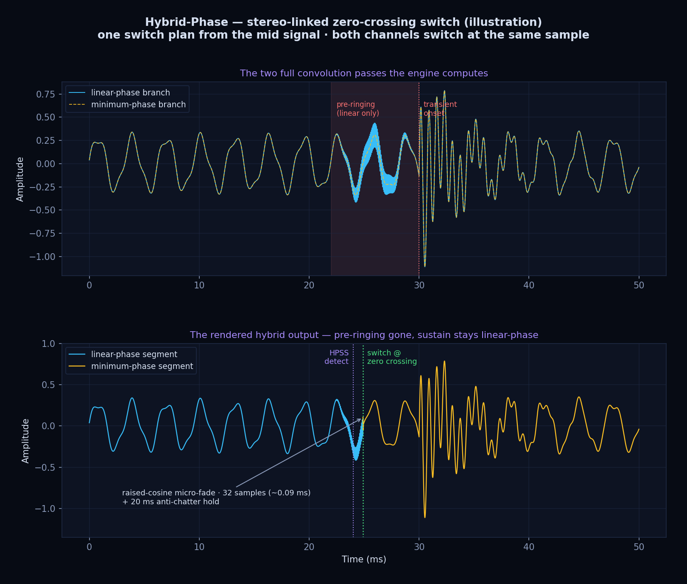
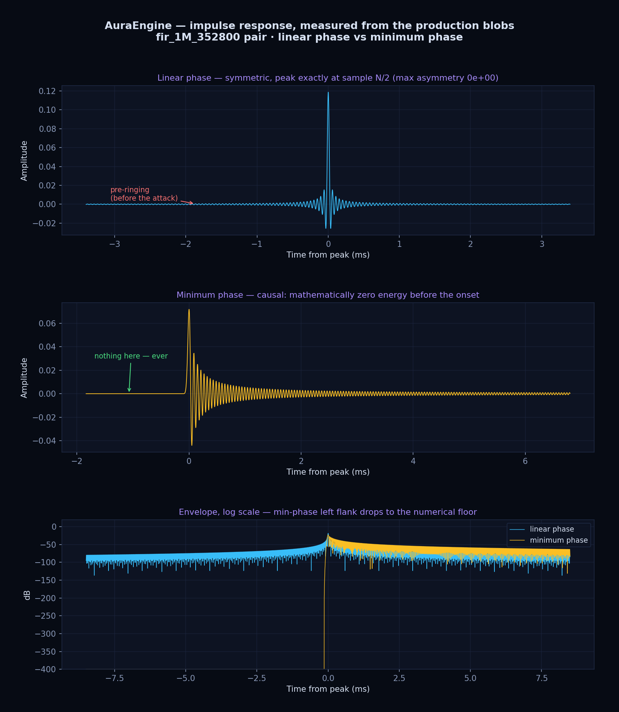

# Measurements — the production filters, actually measured

Every plot on this page (except the last, which is marked as an illustration)
is computed **from the same `.npy` filter blobs the converter loads at
runtime** — the files in `fir-optimizer/output/`, distributed as filter packs
on the [Releases page](https://github.com/ToxaDev/aura-engine/releases).
Nothing is idealised or simulated: if the filters were flawed, these plots
would show the flaws.

**Reproduce everything yourself:**

```bat
cd fir-optimizer
pip install -r requirements.txt
python plot_measurements.py            :: reads output/, writes ../docs/media/
```

The script prints every measured number it embeds into the plots.

---

## 1. Hybrid-Phase switching — the signature (illustration)




A synthetic waveform illustrating the switching logic (the real detector and
switch live in `hpss_native.rs` / `hybrid_phase.rs`; verification of the real
engine is in [doc 06](06-hybrid-phase-proof.md)):

1. Both convolution branches are rendered **in full** — this is why
   Hybrid-Phase costs ~2× processing time.
2. The HPSS onset detector flags the upcoming attack (lookahead).
3. The engine switches linear → minimum phase at a **zero crossing of the
   mid signal**, identically on both channels (stereo-linked — the stereo
   image cannot skew), with a 32-sample raised-cosine micro-fade and a
   20 ms anti-chatter hold.
4. Result: the sustain keeps linear-phase imaging, the attack carries no
   pre-ringing.

Animation source: [`fir-optimizer/animate_hybrid.py`](../fir-optimizer/animate_hybrid.py).

## 2. Frequency response — 30M taps, 44.1 kHz → 352.8 kHz


Key measured values (from `fir_30M_352800_linear_phase.npy`):

| Quantity | Design law ([manifesto](../DSP_MANIFESTO.md)) | **Measured** |
|---|---|---|
| Stopband attenuation (≥ 22.05 kHz) | ≤ −140 dB, zero ripple | **≤ −220.9 dB** |
| Passband ripple (0 – 20.05 kHz) | flat | **± 9.0 × 10⁻¹¹ dB** (± 0.09 nano-dB) |
| DC gain error \|sum(h) − 1\| | 0 (unity gain) | **1.1 × 10⁻¹⁵** |

The stopband begins exactly at the **source** Nyquist (22.05 kHz for
CD-family material) — the per-ratio filter matrix means the runtime never
stretches a filter to a rate it was not designed for.

## 3. Impulse response — linear phase vs minimum phase



Measured from the `fir_1M_352800` pair:

- **Linear phase**: bit-exact symmetric (measured max asymmetry `0.0`),
  peak precisely at sample N/2 — constant group delay at every frequency.
  The cost: sinc sidelobes *before* the peak (pre-ringing).
- **Minimum phase**: strictly causal — the blob's first sample is the onset;
  there is literally no energy before it. All ringing lands *after* the
  attack, where the ear masks it. This is the branch Hybrid-Phase switches
  to on transients.

## 4. Why million-tap filters


The same Kaiser β=14 design measured at four sizes. Measured
−6 dB → −120 dB transition width at 352.8 kHz:

| Taps | Transition width |
|---|---|
| 1M | 1.51 Hz |
| 5M | 0.32 Hz |
| 10M | 0.15 Hz |
| 30M | **0.05 Hz** |

For scale: a typical DAC-chip interpolation filter transitions over
**2 000 – 4 000 Hz**. More taps also push the stopband floor deeper —
from ≈ −195 dB at 1M taps to ≈ −220 dB at 30M.

---

*Generated with [`fir-optimizer/plot_measurements.py`](../fir-optimizer/plot_measurements.py).
Measured values in the tables above are printed by the script on every run —
regenerate the blobs and re-run it to audit the claims.*
