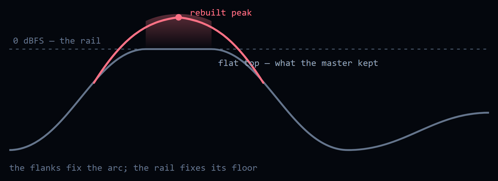
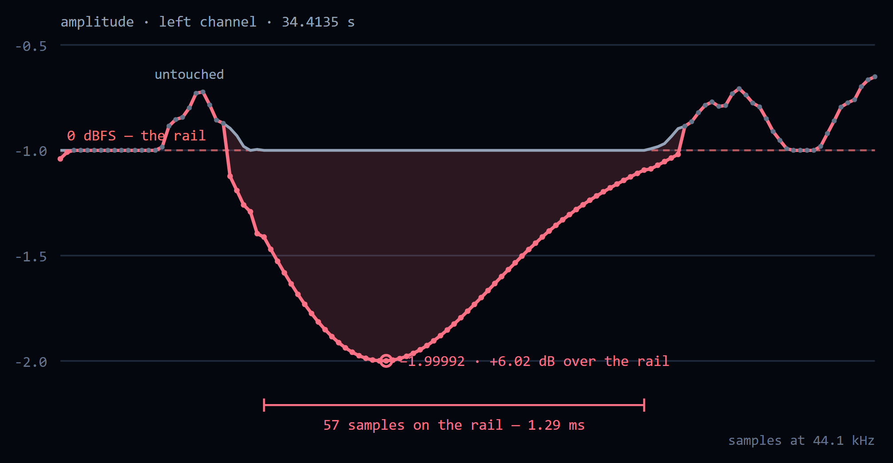
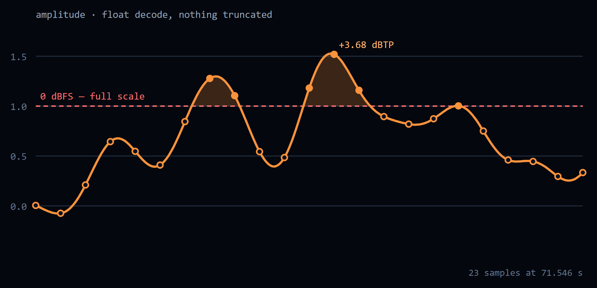
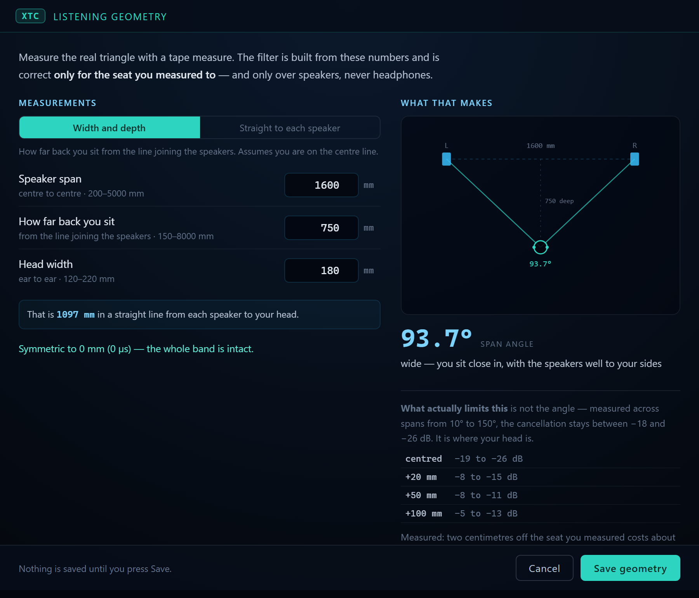
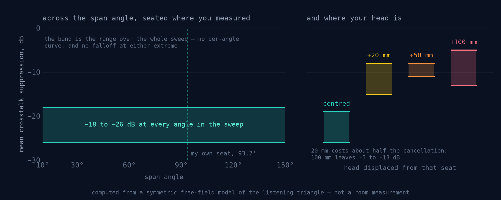

# 18. The Advanced DSP stages

Everything in the **Advanced DSP** rack, what it does, and why it is or is not
switched on when you install the app.

The rack is three plates, and inside each one the stages stand in the order the
pipeline actually runs them:

| Zone | Runs on | Stages |
|---|---|---|
| **1 Source** | the file as decoded, before the filter sees it | `DC` Declip · `ISP` Intersample Peak Correction · `SUB` Subsonic Filter · `AHR` Adaptive Headroom |
| **2 Conversion** | the filter itself, and the phase it is rendered in | `AA` Adaptive Apodizer · `PFR` Polyphase FIR Resampling · `HP` Hybrid-Phase · `αHP` Continuous Alpha · `TFS` TFS Phase |
| **3 Output** | the finished render | `XTC` Crosstalk Cancellation |

The zones are not a second list kept in step by hand — they are slices of one
chain, and that same chain is what the row under each file in the queue draws.

**A fresh install opens with `DC`, `ISP`, `SUB`, `AHR`, `AA`, `PFR` and `TFS`
on.** The three that stay off are the three that need a decision from you:
Hybrid-Phase and Continuous Alpha, because TFS occupies the same slot and costs
half the time; and XTC, because it cannot run at all until you have measured
your listening triangle.

Updating from 1.2.x lands in the same place for the stages 1.3.0 added:
settings saved before them don't mention `DC`, `ISP`, `AHR` or `TFS`, so those
four come up on, while everything you had set yourself stays as you left it.
Switching the four off gives you the 1.2.9 chain back.

Two exceptions, since 1.3.4. If you had Hybrid-Phase on, TFS stays off: the
two can't run on one file, and the one you chose wins. And `PFR` comes up on
once, even if your settings say off. It shipped off before 1.3.0, so an "off"
saved by 1.3.3 or earlier is most likely the old default rather than a choice.
Without it a file takes the standard route, where TFS stands down and a long
track has no segmented route and can be refused for memory. The two routes
measure the same in the audio band ([05 §10](05-converter-pipeline.md#known-issues)).
Switch it off again if you want; from 1.3.4 on that choice is kept.

Every stage that fires writes its token into the output filename and into the
`AURA_CHAIN` Vorbis comment, so a converted file says what was done to it
without anyone having to remember.

---

## `DC` — Declip

A master that was pushed into the rail came back with its peaks flattened. The
flat top carries no information about how high the wave was going; the flanks
either side of it do.

Declip finds those flat runs and rebuilds the arc over them by constrained
autoregressive interpolation. The rail is treated as a **lower bound**, not as a
value: the reconstruction is required to come out at or above the level the
master kept, never below it, because the one thing the file does tell us is that
the wave was at least that high.

Here is the longest flat run in a real track — 57 samples, 1.29 ms — with the
arc the repair puts back:

**It refuses more often than it fires.** A run shorter than 17 samples is a
limiter working, not a clipper, and undoing a limiter is a different job with a
different answer — so the stage stands down and says so. On a 2014 Santana
master, twelve tracks, not one run reached the threshold.

The output ceiling takes the rebuilt peaks back down to a safe level, so a
declipped file arrives quieter than the same file without the stage. That is
the reconstruction being paid for, not a bug — level-match before comparing.

## `ISP` — Intersample Peak Correction

A waveform is not only its samples. Between them the reconstructed signal can go
higher than any sample does — and higher than full scale — which is where a DAC
or a downstream encoder clips a file that "never exceeds 0 dBFS".

ISP scans at 4× with a Lanczos kernel, finds the true-peak overs, and applies
the smallest correction that clears them. Spans that Declip has just rebuilt are
left alone: they are deliberately above the old rail, and holding them down is
the output ceiling's job, not this one's.

ISP has a second half, at the other end of the chain. A master that sits on
its limiter ceiling comes back from the reconstruction with intersample peaks
above full scale — up to +2.6 dBTP on one test track — and the output ceiling
is −0.5 dBTP. One gain for the whole file would take the track down 2–3 dB for
the sake of a few milliseconds, so instead a limiter dips the gain for about
1.5 ms around each over, both channels together, and nowhere else. It steps
aside and leaves the job to the global gain if any over needs more than 6 dB,
or if the dips would cover more than 5 % of the file. On a clipped CD it made
2,553 dips covering 4.7 % of the samples and cost the file 0.1 dB instead of
about 2; the loudness range is the same either way. Its gain dips put a little
energy back below 20 Hz, which is why, since 1.3.3, the subsonic filter runs a
second time after it.

## `SUB` — Subsonic Filter

A linear-phase FIR high-pass at the source rate, flat from its corner up and at
least 100 dB down from half that corner to DC. Click the chip on the row for
20, 15 or 10 Hz; a new install opens on **15 Hz**, which leaves the lowest organ
pipe (16.35 Hz) untouched.

It is there for the infrasonic content and slow drift a disc can carry, which
removing the DC offset does not touch — protection for speakers, not a sound
improvement. Linear phase is the reason to do it offline: nothing above the
corner moves in level or in time.

Since 1.3.3 it runs twice. The pass in this zone takes the disc's rumble out;
a second pass, the same filter at the output rate, runs after the ISP output
limiter. That limiter trims overs with short gain dips, and bass times a
dipping gain puts energy back below the corner — a shelf about 40 dB under
the bass, where the filter promises 100 dB down. The second pass keeps that
promise for the file itself. The rack still shows one `SUB` row.

## `AHR` — Adaptive Headroom

The **Headroom** control names the ceiling the output is normalised to. Adaptive
Headroom decides whether to honour it on this particular file:

| What the source looks like | What AHR does |
|---|---|
| peak already sits below the requested ceiling | keeps the shipped −0.5 dBTP — the cut would cost level for nothing |
| ENOB above 20 bits and peak below −1 dBFS | keeps −0.5 dBTP — a pristine high-bit-depth master |
| anything louder | lowers the ceiling as asked |

So it is a veto on your setting, not a replacement for it — which is why the
badge reads `← Headroom` and will not light while Headroom is on **Off**. With
nothing requested there is nothing to veto, and the stage does not run at all.

Whichever way it goes, the reason lands in the `AURA_HEADROOM` tag along with
the measured peak and ENOB.

## `AA` — Adaptive Apodizer

Per-file forensics on the source: it locates the brick-wall edge, measures
ADC or resampler pre-ringing on real musical attacks, and sets the apodizing
cutoff from what it measured. Clean, minimum-phase-mastered and genuinely
hi-res sources are left untouched. Full detail in
[14 — Adaptive Apodizer v3](14-adaptive-apodizer-v3.md).

## `PFR` — Polyphase FIR Resampling

Your FIR **is** the resampler — there is no second resampler in the chain. The
whole conversion is one exact convolution of the original samples against the
designed filter. Integer ratios only.

## `HP` — Hybrid-Phase · `αHP` — Continuous Alpha

Linear phase through sustained passages, minimum phase across detected attacks,
switched at a zero crossing with a 1 ms fade. Continuous Alpha
replaces that hard switch with a per-sample crossfade driven by the HPSS
envelope, and needs Hybrid-Phase to be on.

Both are **off by default**: they double the processing time, and TFS renders
the same trade differently. Hybrid-Phase and TFS cannot both run on one file —
the rack shows that as `✕ TFS` / `✕ HP`. See
[06 — Hybrid-Phase Proof](06-hybrid-phase-proof.md).

## `TFS` — TFS Phase

Linear phase below 1.5 kHz, minimum phase above 4 kHz, blended across the band
between. The idea is to spend the phase budget where it is audible: low
frequencies keep the exact timing a linear-phase filter gives them, while the
treble is rendered with no pre-ringing ahead of a transient.

The magnitude response is not part of the trade — it matches the linear-phase
render to **±0.000003 dB** across 20 Hz–20 kHz. Only the phase differs.

TFS is derived from the linear- and minimum-phase pair of your chosen filter
size, so it needs **both** blobs on disk; the bundles ship both. The first
conversion at a given size and rate derives the TFS filter and caches it, which
takes minutes and a few GB of RAM at 30M taps — after that the cached blob is
picked up instantly. TFS applies on the Polyphase FIR path; on the standard
path the row reports that it stood down.

## `XTC` — Crosstalk Cancellation

Over speakers, each ear hears both of them. XTC cancels what each speaker sends
to the *wrong* ear, so the stereo image is no longer bounded by the speakers
themselves.

**This is the one stage in the product that deliberately colours the signal.**
Everything else here is either a repair or a rendering choice; this one rewrites
the file for one geometry. It is off by default and cannot be switched on until
you have entered your listening triangle:

Guessed distances do not cancel less — they cancel the wrong thing and reinforce
what the filter exists to remove, so the app refuses rather than assuming. The
same check is repeated on the Rust side, so a hand-edited setting cannot slip
past it.

What it buys, and what it costs when you move:

Both panels are computed from a symmetric free-field model of the triangle, not
measured in a room. Read the right-hand panel before deciding whether this is
for you: **20 mm of head movement costs about half the cancellation.** It is a
one-chair effect, for speakers, never for headphones.

---

## What the row under a file means

Each stage draws one badge, in pipeline order, and each badge is one of three
things — it ran, it was reached and declined (the tooltip says why), or it has
not been reached yet. The bit-perfect check sits last, behind a divider: it is a
verdict on the output rather than a stage of the chain.

A stage that declines is not a failure. Most of these are built to refuse on
material that does not need them, and a run where `DC` and `ISP` both stand down
means the master was already clean.
