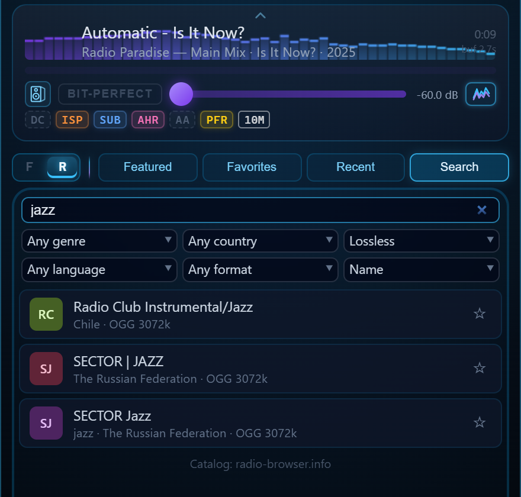

# 19. The Player and Internet Radio

Since 1.5.0 AuraEngine plays what it converts. The player is not a second
engine: it builds its chain from the same rack, the same filter blobs and the
same code as the converter, and it runs that chain against the clock — on the
files in the list and on internet radio streams. This page describes what the
player adds on top of the conversion chain, what a live stream can and cannot
run, the analyzer, and the visualizations. The stages themselves are described
in [05 — Converter Pipeline](05-converter-pipeline.md) and
[18 — The Advanced DSP Stages](18-dsp-stages.md).

- [One engine, two ways to use it](#one-engine-two-ways-to-use-it)
- [1. The player](#1-the-player)
- [2. Internet radio](#2-internet-radio)
- [3. The analyzer](#3-the-analyzer)
- [4. Visualizations](#4-visualizations)
- [5. Keys and menus](#5-keys-and-menus)

---

## One engine, two ways to use it

The question is not offline against real time. There is one engine and one
chain, and it does not quietly give up sound for speed. The converter has no
deadline: every stage runs at full length before anything is written. The
player prepares ahead what a track needs whole and switches each stage in as
soon as it is ready — the badges show which are in — and once every stage is
in, what it sends to the device matches the converted file to −120 dB
(measured on one chain: 30M taps, FS×8, TFS, XTC). When the machine cannot keep
up, the player moves the convolution to a discrete graphics card, then steps
the tap count down for that track, and the taps chip says so. A live stream has
no future to read ahead into: only the two stages that need the whole track,
Declip and the Adaptive Apodizer, stand down there, and their badges are grey.

| | Converter | Player — a file | Player — a stream |
|---|---|---|---|
| **Chain** | The whole rack, every stage at full length | The same rack; the source stages prepared ahead over the whole track | The same rack, as the stream arrives; linear phase through a version of the filter that looks 50 ms ahead ([below](#long-filters-on-a-stream)) |
| **Whole-track stages** | All of them, before anything is written | All of them — switched in as they get ready, or all before the first sound with Instant start off | Declip and the Adaptive Apodizer stand down; the level follows a slow gain under the same ceiling |
| **Album Level** | One level for the tracks of an album | Each track at its own level | — |
| **Hardware** | Any machine: 10M or 30M taps at a high FS just take longer | Real time on the CPU, or on a discrete graphics card; if neither keeps up, fewer taps for that track | As for a file |
| **Output** | A 24-bit FLAC, re-decoded and checked against the f64 render | WASAPI exclusive at the output rate, or BIT-PERFECT | The same |
| **Best for** | Music to keep and play anywhere | Hearing a setting before converting; listening at once | Internet radio |

**Why convert, when the player matches it?** Any filter runs on any machine —
10M or 30M taps at a high FS just take longer. Album Level gives an album one
level, and that needs every track at once. The file plays anywhere — a player,
a streamer, a phone, no PC needed. Listening to it costs no CPU and has nothing
to keep up with. And the file is checked against the f64 render it came from.

**Why play?** To hear a setting before an evening goes into converting with it;
to listen at once, without disk space spent on hi-res copies; and for radio —
a stream cannot be converted, so the player is the one way to put it through
the chain.

---

## 1. The player

### The same chain

A track plays through what its conversion would run: the source stages
(DC removal, Declip, ISP, the subsonic filter, the apodizer), the polyphase FIR
with the rack's phase — linear, TFS, Hybrid-Phase or Continuous Alpha — then
XTC, the ISP output limiter, the subsonic guard and the true-peak gain
(`player/chain.rs`). The source stages are the engine's own preparation code,
run over the whole track in the background; the streaming convolver is the
converter's CPU convolver, made to run block by block. Two kinds of test hold
the player to the converter: the streaming stages against the converter's
whole-file code (`player/equivalence.rs`), and a track played live against the
same track converted with the same rack (`player/file_vs_live.rs`). Measured on
one chain (30M taps, FS×8, TFS, XTC), the samples the player sends to the
device and the converted file differ by less than −120 dB once every stage is
in.

Two things differ on purpose. Album Level is a conversion feature: the player
plays each track at its own level. And a row that has been converted with the
current rack — or with its own settings, when its track memory is on — plays
its converted file from disk: its ▶ turns green, and the DISK chip under the
player says "Playing the converted file from disk — no processing."
(BIT-PERFECT plays the original instead.)

A batch can run while a track plays. The converter's parallel work and the
player's background preparations run below normal priority, so the live chain
is not starved; on an idle machine nothing changes.

### What is in the sound, and when

Some stages need the whole track before they can decide anything — the
Adaptive Apodizer's analysis, the true-peak measurement of the full output,
the Hybrid-Phase onset envelope — so a full chain takes a moment to prepare.

**Instant start on** (the default, in the player's right-click menu): the
sound starts at once, and most of the rack is in it already. Declip, ISP, the
subsonic filter and Adaptive Headroom run over the track as it is decoded,
ahead of what you hear. The level is the one the full chain will use, measured
on the whole decoded track before the first sound (since 1.5.1; a live stream,
which has no whole track, follows the loudest moments a few seconds ahead).
Hybrid-Phase is in the first sound too when its filter pair is
ready or quick to build; otherwise playback starts on linear phase and
Hybrid-Phase blends in shortly after. The Adaptive Apodizer comes in when its
analysis of the whole track is done.

**Instant start off:** nothing plays until every stage is ready, and the first
sound after a start, a seek, a new track or a change in the rack already has
all of them. On an i9-14900K, a four-minute CD track at FS×2 starts that way
in about 1.7 s at 1M taps and 2.1 s at 30M taps on the graphics card; with
Instant start on, the 30M track sounds after about 1.8 s with ISP, SUB and AHR
already in.

**The badges** under the player — one per stage of the rack — say which
stages are in the sound you hear now. A badge is lit when its stage is in the
sound, dim while it is "Switching in — not audible yet.", and fading when a
rack change takes it out. Chips beside them name the
taps playing, the graphics card when it carries the convolution, M (track
memory) and DISK. When nothing plays, a dimmed row previews the stages that
are on. **The arming bar**, a thin line under the badges, fills while the rack
switches in, breathes while it waits, and goes about 1.5 s after the last stage
is on. In BIT-PERFECT there is neither.

### Nothing cuts the sound

- **Seek:** the old place keeps playing until the new one is ready, then the
  player crossfades into it.
- **Next track:** prepared in the background while the current one plays, and
  joined without a gap. When it belongs to the other rate family (44.1 against
  48 kHz) the only pause is the device reopening at the new rate, about 0.6 s.
  Repeat One loops the same way.
- **A change in the rack** goes out 1.5 s after the last click, so ten quick
  clicks make one rebuild, not ten; play, seek, next and previous send a
  waiting change at once. The new chain is built while the old one plays, then
  takes over in place.
- **BIT-PERFECT and the FS multiplier** do the same: the new chain is built,
  the old one fades out over about 120 ms, and the device reopens at the new
  rate, at the same place in the track.
- **Another output device**, chosen while a track plays, pauses it where it is;
  Play goes on from there on the new device. A radio stream fades out and tunes
  in again on the new device.

### On the graphics card

The player measures, on this machine and for the chosen filter, how long the
CPU convolver takes per block (`player/calibration.rs`, kept between runs), and
moves the convolution to the graphics card when the CPU cannot keep up with
room to spare (`player/policy.rs`). The GPU switch in the settings strip covers
conversion and playback alike; playback uses discrete cards only. On an
RTX 4090, 30M taps take about 0.6 GB of video memory and a Hybrid-Phase pair
1.2 GB, and the result matches the CPU's to −280 dBFS. If the card fails in the
middle of a track, the CPU takes over without a gap, and the card is tried
again on the next one. If neither can keep up, the tap count steps down once
for that track, and the taps chip says so.

### The output, the volume and BIT-PERFECT

The device is opened in **WASAPI exclusive mode** at the output rate: nothing
else can play through it at the same time, and it has to accept that rate —
FS×8 means 352.8 or 384 kHz. When the DAC does not take it, or another
application holds the device, the player says so. Converting needs no audio
device.

The volume control runs from −60 to 0 dB. What goes to the device is checked
after it: an output period more than 12 dB louder than the volume allows, or
carrying a value that is not a number, is replaced by silence, and the log
says so (`[SAFETY]`).

**BIT-PERFECT** sends the decoded file to the device untouched: at its own rate
and its own depth (at least 16 bits), with no rack, no volume and no dither. A
lossy file has no depth of its own, so it goes as the widest integer format
the device takes — 32-bit first, then 24 in 32, 24 and 16. While BIT-PERFECT is
on, the volume slider is disabled, track memory waits, and the line under the
badges reads "Bit-perfect: samples reach the DAC unaltered". A file with
samples above full scale shows a warning: BIT-PERFECT sends them unchanged and
the DAC clips them, where the rack would lower the level instead.

### The list, track memory and listening mode

Files dropped on the window join the list where the pointer is; nothing starts
by itself. A row is dragged to a new place, and the player follows the new
order. Each row has **▶** (play; a double-click does the same), **C** (convert
with the rack as it is now), **M** (track memory) and **✕** (remove; it cancels
the row's conversion if one is running). **Convert all** converts every row
not yet converted with the current rack, fills as the batch runs, and ends with
a ✓, the length of audio converted and the speed — the sum of the files'
durations over the time of the whole batch, from the click to the last file
written and checked, shown as ×N. Its tooltip lists the first twelve files with
their own times (and how many more), and a finished row shows its own ×N
beside its ✓ ("N× faster than real time"). Holding it for two seconds cancels
the batch. The same summary, with a line per file, goes into the session log.

**Track memory (M)** keeps the rack for one file: Declip, ISP, the subsonic
filter and its corner, Adaptive Headroom, the Adaptive Apodizer, Hybrid-Phase,
Continuous Alpha, TFS, XTC and its geometry, Headroom and Apodizing. When the
track starts, the rack shows its memory; changes made while it plays go into
it; **C** and **Convert all** use it; on another track or on Stop the previous
rack comes back. The FS multiplier, the resolution, the custom filter, GPU,
Polyphase FIR and Album Level stay global. The memory is keyed by the file
name, so files with the same name share one.

Repeat cycles through off, the whole list and one track; the playlist, the
repeat mode, the device, the volume, BIT-PERFECT and Instant start survive a
restart. A second launch brings the open window forward instead of starting
another copy — the player needs the output device to itself.

**Listening mode** (the L key, or the flap on the player's top edge) folds
the settings away and gives the window to the player and the list; what you
hear does not change. When the pointer leaves a playing player, the controls
give way to the album cover, with the artist, the album and the year.

A first start offers a short tour of the window, zone by zone; the **?** below
the version number brings it back.

---

## 2. Internet radio

### Finding a station

**F / R** at the head of the list switches it between your files and the
radio; what is playing goes on, and the letter of the other view breathes
while something plays there. The radio has four tabs:

| Tab | What it holds |
|---|---|
| **Featured** | Ten stations chosen for how they sound — six stream FLAC at 44.1 kHz, four AAC at 192 kbps and 48 kHz. |
| **Favorites** | Stations you starred (up to 500). |
| **Recent** | The last 20 you played. |
| **Search** | The [Radio Browser](https://www.radio-browser.info/) catalog — tens of thousands of stations — by name, genre, country, language and format, with a quality filter (any, lossless, or 320 / 256 / 192 / 128 kbps and up) and a sort: by name (the closest matches first), most voted, most played, or best quality (lossless first, then the highest bitrate). |

Below the list, **Paste a stream address** plays any `http://` or `https://`
stream, playlist or HLS address. While a stream plays, the player's row has ▶
and ■ only: previous, next and repeat are for files and are hidden — in the
studio, in listening mode and on the full screen — and the files' repeat mode
is kept.
Stopped, the row shows what ▶ would start: the last station, when the radio
played last or the list has no file. Favorites and recent stations are kept in
`%LOCALAPPDATA%\AuraEngine\radio\stations.json`.

The catalog leaves out what this player should not or cannot list: video
stations, stations the catalog marks as broken, and a service whose terms do
not allow third-party players (an address of it pasted by hand still plays).
The app asks the catalog as `AuraEngine/<version>`, as its rules request.

The title of what is playing comes from the stream — its ICY metadata, its
container's tags (Vorbis comments, a chained Ogg's next link) or its HLS
segments — or, for one station whose stream carries none, from its own
now-playing service. Each title is pinned to the frame it belongs to and shows
when that frame is heard, not when the server announces it.

### Formats

| | |
|---|---|
| Codecs | MP3, AAC-LC, HE-AAC v1/v2, FLAC (also in Ogg, chained links included), Vorbis, Opus |
| Decoders | Symphonia for MP3, AAC-LC, FLAC and Vorbis; the FDK AAC decoder (Rust, from AOSP, built into the program) for HE-AAC, with no limiter, loudness normalisation or DRC of its own; libopus 1.6.1 for Opus. Nothing depends on what Windows has installed. |
| Transports | HTTP(S) with ICY metadata; .pls and .m3u playlists (the first stream entry); HLS — MPEG-TS, packed ADTS or MP3, and fMP4 segments; the variant with the highest bandwidth, AAC-LC before MP3 before HE-AAC at equal bandwidth |
| Not played | Encrypted HLS ("This stream is encrypted: it can't be played.") |
| Rates | 44.1 and 48 kHz and their multiples up to 705.6 / 768 kHz; another rate shows "This stream's sample rate can't be upsampled" — except in BIT-PERFECT, which plays any rate the device takes |
| Channels | Mono plays on both channels; channels beyond the front pair are not played |

The whole path, from the decoder to the filter, is 64-bit floating point.

### What a stream runs

A live stream has no whole track, so the stages that need one stand down; the
rest of the rack runs as the stream arrives.

| Stage | On a file | On a stream |
|---|---|---|
| DC removal | per-channel mean (or the 2 Hz high-pass) | always the 2 Hz high-pass |
| `DC` Declip | runs | does not run — grey: "declip needs the whole track: off on a stream" |
| `ISP` Intersample Peak Correction | runs, and limits the output | runs as the audio arrives, and limits the output |
| `SUB` Subsonic Filter | source pass + guard on the output | the same two passes; the first sound waits for half the filter plus one partition: 0.43 / 0.54 / 0.77 s at 44.1 kHz for 20 / 15 / 10 Hz |
| `AHR` Adaptive Headroom | decides on the whole track | decides on the stream's first ten seconds, once |
| `AA` Adaptive Apodizer | runs | does not run — grey; while it is on, the static presets are locked off, so a stream plays without an apodizer |
| Apodizing preset | when the Adaptive Apodizer is off | when the Adaptive Apodizer is off, on streams up to 48 kHz |
| Linear phase (PFR) | the full linear filter | its stream version, 50 ms ahead — below |
| `TFS` | runs | runs, 30 ms ahead |
| `HP` / `αHP` | runs | runs from the first sound; their linear branch is the stream version |
| `XTC` | runs | runs |
| Level | the true-peak ceiling, measured on the whole output | a slow gain that follows the loudest moments ahead, under the same ceiling |
| `ALB` Album Level | conversion only | — |

The source stages on a stream compute every block with the same functions as
on a file, so a stream through them gives the samples a prepared track would
give with the same settings (`player/source_stages.rs`, tested against the
whole-file code).

### Long filters on a stream

A linear-phase filter looks ahead by half its length — 1.4 s for 1M taps at
352.8 kHz, 42.5 s for 30M — and a live stream would have to be that far in
before its first sound. All of that look-ahead is ringing at the wall: ahead of
its centre, a linear filter rings only at its cutoff. So on a stream the player
uses a version of the same filter (`dsp/lab/stream_linear.rs`): the shipped
filter's magnitude at every frequency, the wall included, and its stopband;
linear phase up to 20 kHz (22 kHz for 48 kHz streams) and minimum phase only in
the last kilohertz under the wall. It looks 50 ms ahead (25 ms on hi-res
streams). Against the full filter it differs by less than −200 dBFS in the
audio band on music. TFS looks 30 ms ahead, minimum phase not at all.

The stream version is derived from the shipped pair once per tap length and
rate, checked, and kept beside the linear blob as
`fir_<TAG>_<rate>_stream_linear_v1.npy` — at 10M taps that takes about 7 s, and
the radio view prepares it in advance while it is open ("Preparing this filter
for streams (once)…"). If a check fails, nothing is kept and the shipped filter
plays. 5k needs no stream version: its look-ahead is already a few
milliseconds. A stream plays the tap count the rack is set to (or the nearest
installed length); files and conversions keep the full linear filter.

### Starting, dropouts and clock drift

**Tuning in.** A stream starts once 8 seconds have gathered, on top of what the
filter and the source stages hold back; the arming bar fills with what has
arrived. If the network leaves the buffer empty, the player plays silence after
400 ms, waits for 8 s again, and asks for half as much again on each later
dropout, up to 30 s. While paused it keeps gathering, up to ten minutes ahead.

**Reconnecting.** Ten seconds without data count as a break. The player
reconnects (after 1, 2, 4, 8, then every 10 s; a station that never answered
is given up after three tries, one that has played is tried indefinitely),
looks for the place where the new connection repeats the last 30 seconds it
already has, and skips the repeat, so the music goes on without a seam. MP3,
FLAC and Vorbis are matched by their samples; AAC, HE-AAC and Opus by their
frames, and the same decoder carries on, so the samples come out as they would
have without the break. When no overlap is found, the join is a 10 ms fade. On
one FLAC station a dropped connection came back with 8.5 s of repeat, and none
of it was heard twice.

**Clock drift.** The server's clock and the DAC's never quite agree, so over
hours the buffer drifts (`player/radio/drift.rs`). After a warm-up of five
minutes and ten more of measuring, the player keeps it within a second of
where it should be: it drops or repeats 10–40 ms in a quiet place in the music,
or up to 200 ms in silence, with a 10 ms crossfade, at most once in half a
minute. Nothing is resampled.

### BIT-PERFECT on a stream

BIT-PERFECT works on the radio too. The stream goes to the device as decoded,
at its own rate, with no rack and no volume: a FLAC station at its own depth,
a lossy one as the widest integer format the device takes. Switching it on or
off while a station plays happens in place — about 120 ms of fade, the device
reopens, and the stream goes on from where you were. Changes to the rack wait
until it is off.

### What upsampling a stream can and cannot do

It cannot add what the codec removed. A 128 kbps MP3 stream stays a 128 kbps
MP3 — played through a better reconstruction filter, with its overs kept
rather than clipped. Stations that stream FLAC are where the rack has the most
to work with.

---

## 3. The analyzer

A window of its own (`analytics.html`, `player/analytics/`). **Ctrl+Shift+A**
opens the live window on what you hear now; the player's analyzer button does
the same. A row's right-click menu offers "Analyze this file" and "Analyze
converted file" (each opens a window of its own), and, on the playing row,
"Live analyzer — what you hear now". The key **A** on a row analyzes its file.

The window's title says what it is listening to: the live window names the file
or the station and its song as it changes, a file's window its file, and an
export names what was heard. One gold line shows the whole-track analysis with
its percentage, and the status bar says when the whole track is analysed; a
file played after the radio is analysed at once, its source first.

**Three signals, side by side.** **S** is the source, the file as it is. **B**
is the source after the rack's source stages (DC, ISP, SUB, AHR), before the
filter — hidden by default, one click shows it. **O** is the output: the whole
track through the chain you hear, rendered and measured in the background while
the window is open.

**The table** measures each of them over the whole track, over the stretch
selected on the spectrogram, and — in the live window — live:

| Group | What it shows |
|---|---|
| Loudness | integrated (LUFS-I), short-term and momentary maxima, LRA |
| Peaks | true peak by BS.1770 and by the engine's own 4× reading, sample peak, where the peak is |
| Dynamics | DR (the common crest-factor DR), RMS, the gain to −18 LUFS, PLR |
| Clipping | runs of flat samples in the source; samples past full scale and true-peak events above 0 dBTP in the output |
| Spectrum | DC offset, energy above and below the audio band, stereo correlation, effective bandwidth |

**The spectrogram** uses a Kaiser window (β 16) on a 4096-point FFT at 44.1 and
48 kHz (longer at higher rates), 512 logarithmic bands from 20 Hz to the
source's Nyquist (the output's own bands continue above it), and blends three
resolutions: longer below about 200 Hz, shorter above about 3 kHz. Scales:
Log, Lin, Mel, Bark; colour maps: Inferno, Magma, Viridis, Grayscale. The
views S, B, O, **S | O** (one above the other on one axis), **O − S** (what
the chain changed: blue quieter, red louder, black the same) and **B − S**
(what the source stages changed). The wheel zooms time, Alt+wheel or the wheel
over the ruler zooms frequency, a drag moves, a double-click shows the whole
track; the readout gives the frequency with its note name, the time and the
levels. **Shift+drag** selects a stretch, and the table measures it alone.

**Other tabs:** Spectrum (whole track, live, the selection; key S freezes up to
eight snapshots of the output curve to compare), Loudness History (the pointer
reads the time and the short-term loudness of S and O), Waveform (down to
single samples with the reconstruction between them and intersample overs in
red, following the playback; the pointer reads the time and the peaks of S and
O),
Histogram, and Stereo (vectorscope, correlation, width). **Export:** the
metrics copy as text in the formats forums use for DR and true-peak reports and
save as TSV; the loudness history saves as CSV; the window or one graph saves
as PNG. CSV and TSV carry a byte-order mark, so spreadsheets read them as
UTF-8.

The heavy whole-track work — decoding S, its spectrogram, B and the O pass —
runs only while an analyzer window is open, so playback without it costs no
extra CPU. The window offers a short tour of itself the first time it opens.

**On a radio stream** there is no whole track, so those cells show "—" ("A
live stream has no whole track: these are measured on files."), and there is
no B. The window measures S — the stream as decoded, before the rack's source
stages — and O live, and totals their integrated loudness, LRA, highest true
peak, loudness histogram and stereo correlation twice: **This song**, since the
current song began (songs are cut where
the stream's title changes, so their edges are approximate), and **Session**,
since you tuned in or pressed ↺; DR is measured for each song. The **Songs**
list keeps the songs heard, how long each played and its bandwidth. A line
under the title gives the stream's format, bitrate and rate and its **Source
bandwidth** — where its spectrum really ends, measured on what has played: a
lossy codec cuts the top (an MP3 at 128 kbps near 16 kHz, AAC near 19–20 kHz),
a lossless stream reaches half its sample rate ("full, 22.05 kHz").

The views keep the stream as it plays and follow its live edge; moving one by
hand stops following, and **Follow** (on the spectrogram and the waveform)
takes it back to the edge with its zoom.

| View | On a stream |
|---|---|
| Spectrogram | about the last three minutes, the last 20 seconds at first. The wheel zooms time at the pointer (over the frequency ruler or with Alt, frequency), a drag or Shift+wheel looks back, a double-click or **Fit** shows all of it; the time ruler shows what is kept and the view within it, and the readout gives S, O and O − S under the pointer |
| Loudness History | the last 30 minutes, the last five at first. Ctrl+wheel zooms in time at the pointer, the wheel sets the dB range, a drag or Shift+wheel moves, a double-click comes back to the last five minutes at the edge |
| Waveform | the last 30 minutes of S and O in two lanes. The wheel zooms at the pointer, a drag looks back, a double-click shows it all and follows again, and the pointer reads the time and both peaks; the minimap under it holds all that is kept — a click takes the view there, a drag moves it, its edges zoom |
| Histogram | the short-term loudness of this song or of the session (a switch at the top right), S and O; "Measuring…" until the first 3 seconds are heard |
| Stereo | under the live correlation and width, this song's and the session's correlation for S and O |

The loudness saves as CSV: the last 30 minutes, a row per 100 ms on the
stream's clock with the short-term and momentary loudness of S and O, the
song's true peak and its title (this station's songs only; tuning a station
anew starts the curves afresh). The DR report names the station's codec. In
BIT-PERFECT the output is the source, sample for sample, and one set of
numbers stands for both ("= S").

---

## 4. Visualizations

### Scenes

In listening mode the player can draw the music. A scene is one text file, an
`.aura-vis`: GLSL written against the app's contract, rendered by WebGL 2 in
the player, with its settings declared in `// @param` lines. Because the player
renders ahead of what you hear, a scene sees the next ~3.5 seconds of sound —
it can show a kick on its way and have it land as it sounds. The contract is
the specification that comes with the app:
[`AURA-VIS-SPEC.md`](../desktop-app/src/vis/AURA-VIS-SPEC.md), and
[`AURA-VIS-SPEC-INSTRUMENTS.md`](../desktop-app/src/vis/AURA-VIS-SPEC-INSTRUMENTS.md)
for scenes that follow the instruments.

Nineteen come with the app: Aurora, Bars, Better Rain, Diamond Dust, Diamond
Dust Stage, Horizon, Lineup, Nebula, Neon Portal, Neonwave Sunset, Night
Ridges, Phosphorescent Peaks, Raindrops, Scope, Speaker, Speaker Field, Stage,
Tourbillon and Tunnel. All scenes, the app's and your own, live in
`%LOCALAPPDATA%\AuraEngine\visualizations`; the studio can bring back the
app's own if one is lost.

### The studio

Visualization › Studio… opens it. The code recompiles a moment after you stop
typing, and errors point at the scene's own lines; every `@param` becomes a
slider, a checkbox, a list or a colour, and changes go live to the player. It
takes Shadertoy's multipass shaders — Common, Buffers A–D and Image, pasted in
as the shader's JSON — and writes the author, the link and the licence into
the scene's header; the album cover is one of the inputs a scene can read. New,
Import…, Duplicate…, Export… and Folder manage the scenes; Show in player puts
one on the player.

### Scenes with instruments

Three scenes — **Stage**, **Lineup** and **Diamond Dust Stage** — draw each
instrument of the song on its own: the kit piece by piece, the bass, the voice
and the rest, where each sits left to right and how near, with their hits and
notes (`src-tauri/src/spatial/`).

They need a pack of models the app does not carry:

| | |
|---|---|
| Download | `aura-instruments-pack-2.zip` from the [releases page](https://github.com/ToxaDev/aura-engine/releases/tag/instruments-pack-2), 282 MB, once, when such a scene is first chosen; an interrupted download resumes |
| Checked | the archive's SHA-256 is fixed in the app, and every file in it is checked by size and SHA-256 as it is unpacked, before anything in it is used |
| On disk | 374 MB installed; 724 MB free while it installs |
| Inside | HTDemucs (six sources), DrumSep (an MDX23C model), Basic Pitch, ONNX Runtime 1.24.4 with DirectML, and `LICENSES.txt` with their licences |

Each track is analysed once, in the background, and kept by its audio content
(not its path) in `%LOCALAPPDATA%\AuraEngine\spatial\maps`, the least recently
used going first above 300 MiB. On an RTX 4090 a four-minute track takes 15–25
seconds. The separation runs on the graphics card when it has 3 GB of video
memory free, and on the CPU otherwise; the drum kit is split piece by piece
only on the graphics card — without one it is told apart by its bands. The
notes are found on the CPU.

**On a radio stream** the instruments are found as the stream plays: it is
taken apart on the graphics card a little ahead of what you hear, so they come
a few seconds after a station starts, and each song's picture gains
instruments as they join in. A new song begins where the stream says so, or
else after two seconds of silence, and at the latest after ten minutes. The
separation wants 3 GB of video memory free — or, when the player's own
convolution is on the same card, 2.4 GB plus its share, if that is more — and
it steps aside when memory runs short or a new chain is being built, then
comes back. The kit comes piece by piece — the toms and the cymbals once they
play — where the card has room for the drum network beside the separation
(about 1.5 GB more of free memory); otherwise it is kick, snare and hi-hat
taken from the drums' sound. Every instrument but the drums has its notes about
two seconds before it sounds (on a file, 3.5 s), found on the CPU, and on a file
and a stream alike it flashes on its strong notes. At first the notes of the
guitars, the keys and the rest go to their places by pan; once their source
has played some forty strong notes in the song, it is split into its
instruments by their notes, as on a file, and each place is taken over by the
instrument nearest to it, which keeps its slot and changes its colour once. A
place no instrument takes goes silent and keeps its slot; a later instrument of
the same source near it takes it. Until the instruments are there, the scene
draws the mix and says so ("Separating instruments…"); without a graphics card,
or without enough of its memory free, it shows the mix and says why.

### Picture delay, bars, full screen

**Picture delay** (right-click menu, per output device, −100 to +400 ms) holds
the bars and the scenes back by the time a DAC's own filter or active speakers
add and Windows does not report; the menu shows what Windows does report.
**Spectrum bars** can be hidden, so the picture fills the whole player, and
**Full screen** puts it on the whole screen (Esc brings it back).

### Credits and licences

Eight scenes are the app's own. Eleven are adaptations of work published on
[Shadertoy](https://www.shadertoy.com/), and each keeps its author, its link and
its licence in its header:

| Scene | After | Licence |
|---|---|---|
| Better Rain | "Better Rain" by ixmibrahim, a fork of "Heartfelt" by Martijn Steinrucken (BigWings) | CC BY-NC-SA 3.0 |
| Diamond Dust, Diamond Dust Stage | "Diamond Dust Mk II" by Tonny Espeset | CC BY-NC-SA 3.0 |
| Neon Portal | "For the neon style enjoyers" by mrange | CC0 |
| Neonwave Sunset | "Neonwave Sunset" by mrange; `blackbody()` by Stephane Cuillerdier (Aiekick) | CC BY-NC-SA 3.0 (its `blackbody()`; the rest CC0) |
| Night Ridges | "neonwave but darker" by espeon, after mrange | CC0 |
| Phosphorescent Peaks | "MountainBytes: PPPP 4KiB Windows" by mrange (code) and Virgill (music) | CC0 |
| Scope | "Scope Multipass Feedback" by weyland | CC BY-NC-SA 3.0 |
| Speaker Field | "Sonic test site" by El_Sargo | CC BY-NC-SA 3.0 |
| Speaker | "Speaker visualizer" by Jan Mróz (jaszunio15) | CC BY 3.0 |
| Tourbillon | "Tourbillon" by patrickjaillet | CC BY-NC-SA 3.0 |

The helper functions these scenes carry are credited in them as their original
code credits them — Inigo Quilez's, Pascal Gilcher's and hg_sdf's under MIT,
Sam Hocevar's HSV under WTFPL, Dave Hoskins' hash, and a few that the original
code itself lists without a known licence. These scenes are not under the project's
PolyForm licence: each keeps its own. The models in the instruments pack keep
theirs too — HTDemucs (Meta) and ONNX Runtime under MIT, Basic Pitch (Spotify)
under Apache 2.0, DrumSep (aufr33 and jarredou) under CC BY-NC-SA 4.0, DirectML
under Microsoft's terms — in `LICENSES.txt` inside the pack.

---

## 5. Keys and menus

| Key or place | What it does |
|---|---|
| **Space** | Play / pause |
| **L** | Listening mode on and off |
| **Ctrl+Shift+A** | The live analyzer |
| **A** on a row | Analyze this file |
| Double-click a row | Play it |
| **F / R** (Tab to it, then Space, Enter, ← or →) | Files or radio |
| Hold **Convert all** for 2 s | Cancel the batch |
| Player, right-click (studio) | Listening mode · Picture delay › · Instant start |
| Player, right-click (listening mode) | Visualization › (scenes by name, Album, Off, Studio…) · Spectrum bars · Full screen · Picture delay › · Instant start |
| Row, right-click | Live analyzer — what you hear now (on the playing row) · Analyze this file · Analyze converted file |
| **?** below the version number | The tour |

In the analyzer: **S** freezes the output curve on the spectrum, Ctrl+Z drops
the last one, **B** shows B on the spectrum, Ctrl+Shift+S saves the window as
PNG, and Esc clears a selection.
